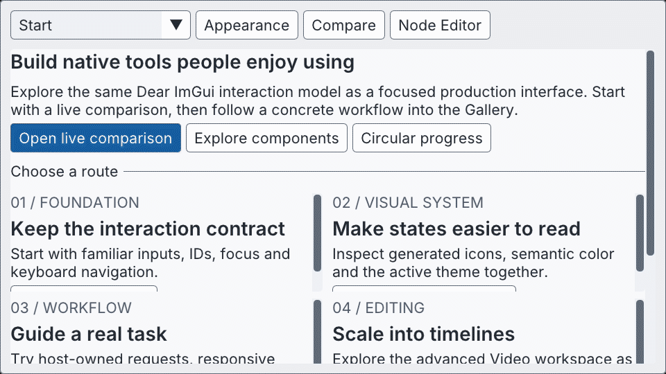
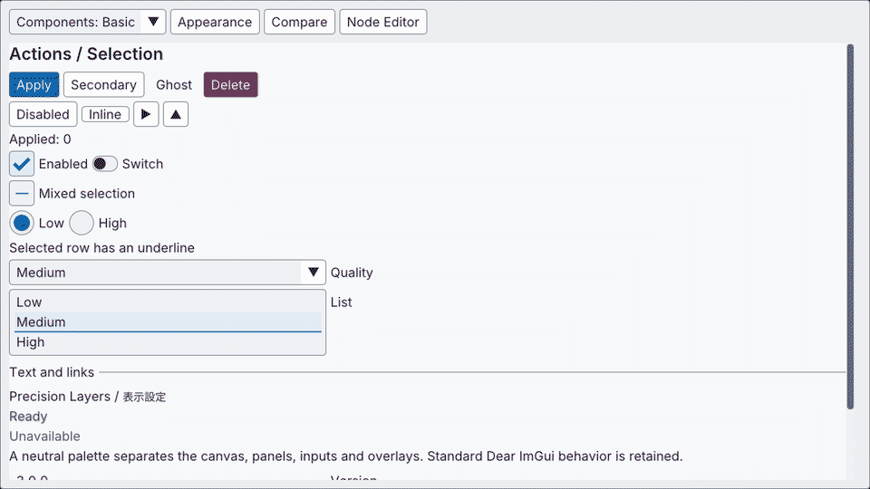
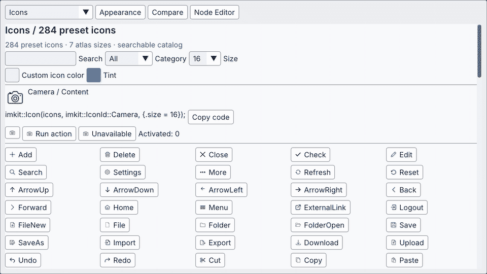
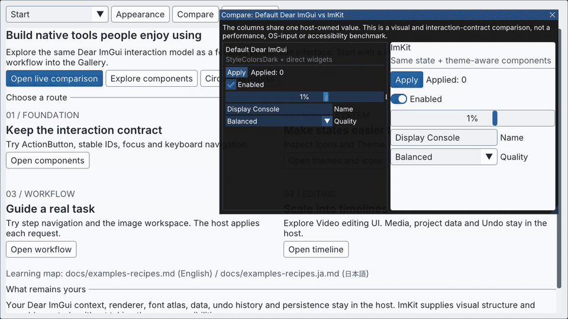
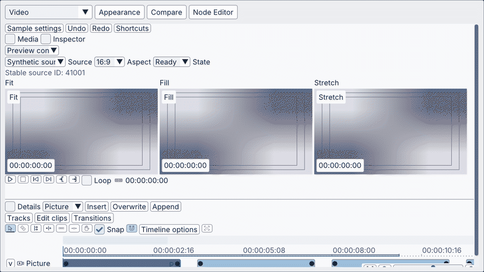
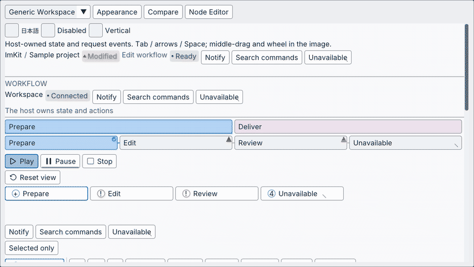
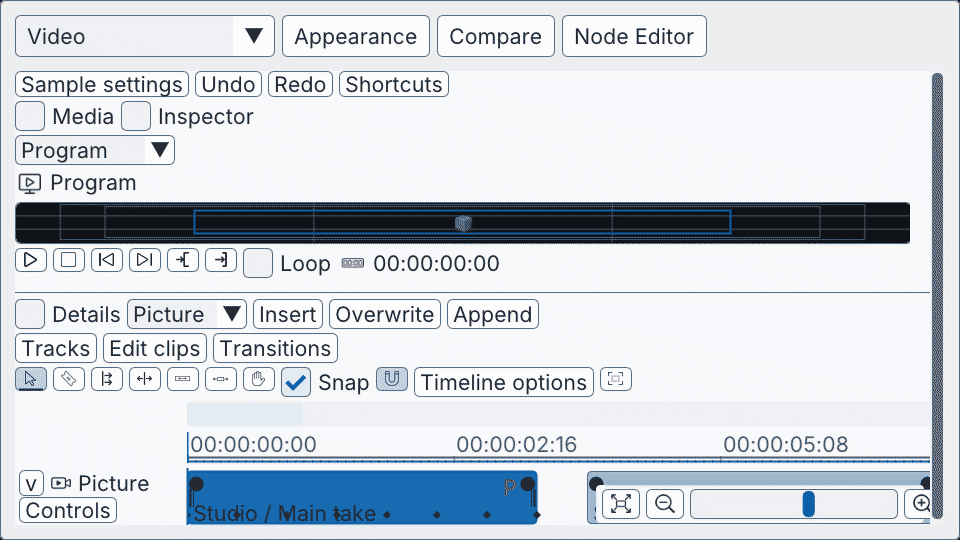
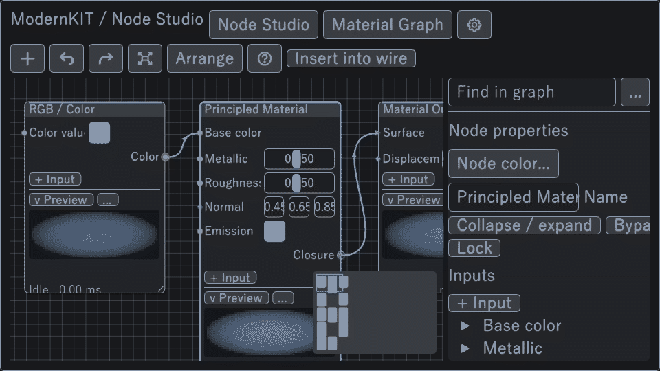
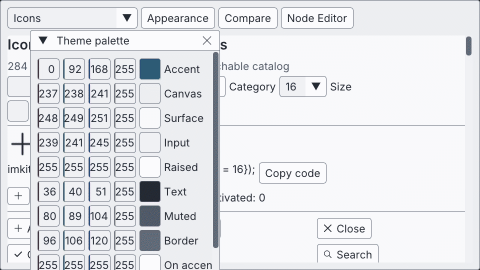

# ImKit

**Dear ImGuiで、使い心地まで整ったネイティブ制作ツールを。**

ImKitは、既存のDear ImGuiアプリにテーマと再利用できるUI部品を追加するC++20の静的ライブラリです。まずGalleryで動作を確かめ、必要な部品だけをアプリに組み込めます。

[English](README.md) · [最新リリースをダウンロード](https://github.com/AokiMotohide/imgui-modern-kit/releases/latest) · [文書一覧](docs/README.ja.md) · [Release一覧](https://github.com/AokiMotohide/imgui-modern-kit/releases)

## まずGalleryを試す

お使いの環境に合う[v3.1.0のパッケージ](https://github.com/AokiMotohide/imgui-modern-kit/releases/tag/v3.1.0)をダウンロードして展開し、次を起動してください。

- Windows: bin/imkit_gallery.exe
- macOS: imkit_gallery.app

Node Editor専用のGalleryも同梱しています。Galleryでは、利用するアプリと同じImKitライブラリと公開部品を使っており、デモ専用の代替ウィジェットは使っていません。

Windowsでソースからビルドする場合は、次のコマンドを実行します。

    cmake --preset windows-debug
    cmake --build --preset windows-debug --target imkit_gallery --parallel
    ./build/windows-debug/catalog/Debug/imkit_gallery.exe

## 既存アプリへ組み込む

アプリがすでに使っているDear ImGuiのtargetをImKitに指定します。

    set(IMKIT_IMGUI_TARGET host_imgui)
    add_subdirectory(external/imgui-modern-kit)
    target_link_libraries(your_app PRIVATE imkit::imkit)

ImGuiのフレームを開始する前にテーマを適用し、通常のウィンドウ内で部品を描画します。

    #include <imkit/imkit.h>

    auto theme = imkit::MakeTheme(imkit::ThemePreset::Ocean);
    imkit::ApplyTheme(theme, 1.0f); // ImGui::NewFrame()より前

    if (imkit::Begin("Display")) {
        static bool enabled = true;
        imkit::Toggle("Enabled", &enabled);
        imkit::ActionButton("Apply", imkit::ActionVariant::Primary);
    }
    imkit::End();

Dear ImGuiのコンテキスト、描画バックエンド、レンダラー、フォント、データ、Undo履歴、保存処理、ワーカーは、引き続きアプリ側が管理します。ImKitは現在のコンテキストにUIを描画します。

## 作れる画面

- **テーマと基本部品** — ボタン、トグル、選択状態、検索、アイコン、状態を見分けやすい配色。
- **ワークフロー画面** — 作業手順の案内、通知、進捗表示、アプリ側で構成するシェル。
- **編集用部品** — タイムライン、インスペクター、曲線編集、階層表示、プレビューモニター、追加可能なNode Editor。
- **ネイティブ連携** — OpenGL／Metalによるプレビュー描画、ウィンドウ枠、アクセシビリティ連携。

必要な部品に応じてCMakeターゲットを選んでください。[モジュール別の実装例](docs/examples-recipes.ja.md)では、ターゲット、公開ヘッダー、Galleryの該当画面、描画ループから呼び出す位置を対応付けています。

## 画面で見る

### Galleryの概要

目的に合う画面を開き、実例を操作してから導入ガイドへ進めます。

### 基本コンポーネント

よく使う部品を、通常・切り替え後・混在選択の状態で確認できます。

### プリセットアイコン 284種

**線画のプリセットアイコンを284種類収録しています。サイズは12〜64 pxの7段階で、アイコンとサイズの組み合わせは計1,988通りです。** 一覧はタイル表示で、名前やカテゴリから絞り込めます。

Galleryではタイル一覧からアイコンを選べます。選んだアイコンのプレビューと、C++での呼び出し例も表示します。

### Dear ImGuiとのライブ比較

Dear ImGuiの標準部品とImKitを並べ、アプリ側で管理する同じ値を両方から変更できます。

### Previewの配置と状態

Fit／Fill／Stretchの配置と、Ready、Loading、Empty、Offline、Errorの各状態を確認できます。

### Workflowと進捗

作業の案内、通知、ダイアログ、進捗表示を組み合わせても、状態の管理はアプリ側に残ります。

### Timeline

タイムラインの操作と編集時の表示を確認できます。データと操作履歴はアプリ側で管理します。

### Node Editor

グラフの描画と編集要求を使えます。グラフモデルの検証・評価・Undoはアプリ側で管理します。

### Theme

名前付きThemeとpaletteをネイティブGalleryで見比べられます。

## 対応環境

v3のABIはDear ImGui 1.93.0 WIP docking commit 367b2c24f399988ddafc0bb4628da0106bcc09beを基準にしています。配布パッケージはWindows x64／Arm64、macOS arm64／x86_64、macOS Universal 2に対応します。

macOSのパッケージには署名・公証を行っていません。自動検証では、実機の入力操作、OS標準IME、画面読み上げ、複数のDPI設定を組み合わせた表示、外部アプリへの組み込みを確認していません。[検証範囲](docs/validation.ja.md)と[依存関係](docs/dependencies.ja.md)を参照してください。

## 文書

- [文書一覧](docs/README.ja.md)
- [導入ガイド](docs/getting-started.ja.md)
- [部品と使い方](docs/guide.ja.md)
- [モジュール別の実例と実装例](docs/examples-recipes.ja.md)
- [Galleryガイド](docs/gallery.ja.md)
- [Node Editorの導入](docs/node-editor.ja.md)
- [v3移行ガイド](docs/migration-v3.ja.md)
- [設計と所有権](docs/architecture.ja.md)
- [変更履歴](CHANGELOG.md)

## ライセンス

ImKitはMITライセンスです。Dear ImGui、GLFW、任意のフォント資産には、それぞれのライセンスが適用されます。利用したリビジョンとハッシュ、ライセンス表記は[THIRD_PARTY_NOTICES.md](THIRD_PARTY_NOTICES.md)を参照してください。
