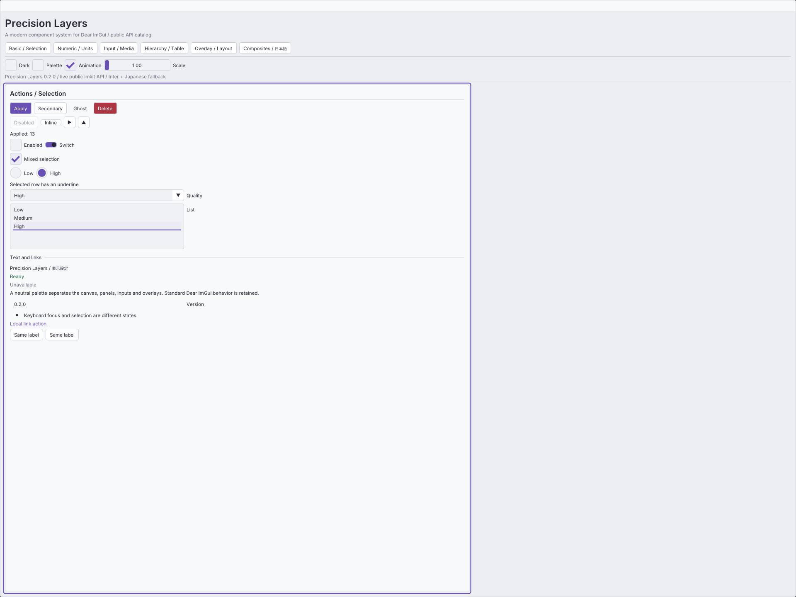

# imgui-modern-kit

[English](README.md) · [Release v0.2.0](https://github.com/AokiMotohide/imgui-modern-kit/releases/tag/v0.2.0) · [利用ガイド](docs/guide.ja.md) · [API対応表](docs/api-coverage.md)

**Precision Layers**は、Dear ImGui向けのコンパクトなモダンデザインです。無彩色に近い階層面、28pxの基本操作高さ、6pxの間隔、4pxの角丸、細い境界、選択マーク、重要度別のボタンを備えます。light/darkの配色は値として変更できます。

ImKitは**C++20の静的拡張ライブラリ**です。動的プラグインや独自rendererではありません。公開GUI APIの標準overloadを公開し、共通Themeで標準描画を統一します。選択・タブには公開DrawListによる装飾を加えます。Switch、混在チェック、分割選択、検索付き選択、単位付き入力、設定行、状態バッジ、通知、ツールバーも提供します。実装の区分は[overload単位の対応表](docs/api-coverage.md)で確認できます。



## 導入

対応基準は **Dear ImGui v1.92.9b-docking**、commit `b48d1afbe8ee8b238e2961dc363a949dd7304e23`です。異なる版を暗黙にABI互換とは扱わず、コンパイル時に拒否します。標準の導入方法はソースからのビルドです。

```cmake
# 対応するDear ImGuiの本体を含むhost_imguiを先に作成
set(IMKIT_IMGUI_TARGET host_imgui)
add_subdirectory(external/imgui-modern-kit)
target_link_libraries(your_app PRIVATE imkit::imkit)
```

```cpp
#include <imkit/imkit.h>

auto theme = imkit::MakePrecisionTheme(imkit::ColorScheme::Dark);
imkit::SetAccent(theme, ImVec4(0.53f, 0.79f, 0.73f, 1.0f));
// ホストがContextを作成した後、NewFrameより前
imkit::ApplyTheme(theme);
// ホストのフレーム内
if (imkit::Begin("Settings")) {
    static bool enabled = true;
    imkit::Checkbox("Enabled", &enabled);
    imkit::ActionButton("Apply", imkit::ActionVariant::Primary, {}, {&theme});
}
imkit::End(); // Beginがfalseでも必要
```

Context、frame lifecycle、font atlas、renderer、ID、編集値はホストが所有します。ImKitはContext作成、フォントの読み込み、OSパス探索、設定の自動保存、スレッド作成を行いません。ライブラリだけの組み込みではGLFW/OpenGL/画像取得ターゲットを作成せず、依存物もダウンロードしません。

## カタログとビルド

Windows、Visual Studio 2026のC++環境、対応generatorを備えたCMakeで実行します。

```powershell
cmake --preset windows-debug
cmake --build build/windows-debug --config Debug --target imkit_gallery imkit_api_compile imkit_context_smoke
./build/windows-debug/catalog/Debug/imkit_gallery.exe
```

6カテゴリのカタログは配布APIを使用します。日本語、配色編集、倍率変更を含みます。`--capture --output out/catalog`は実OpenGL画像、`--verify`は公開IOによる代表操作の確認です。任意の`IMKIT_BUILD_DESIGN_GALLERY`は過去のデザイン比較を残す実験ターゲットで、製品カタログではありません。

## 配布と文書

Releaseにはソースarchiveと、Debug/Release別ライブラリ、CMake設定、manifest、SHA256SUMSを含むWindows x64 SDKを用意します。SDKのcompiler/CRT/ImGui構成は一致が必要です。[インストール済みSDKの利用](docs/guide.ja.md#インストール済みsdk)を参照してください。

[利用ガイド](docs/guide.ja.md)、[設計](docs/architecture.md)、[API対応表](docs/api-coverage.md)、[検証と制約](docs/validation.md)、[変更履歴](CHANGELOG.md)。

## ライセンス

ImKitのコードはMITです。Dear ImGui・GLFWにはそれぞれのライセンス、任意のInter・Noto Sans JPフォントにはSIL OFL 1.1が適用されます。[第三者通知](THIRD_PARTY_NOTICES.md)に原文、出典、固定hashを記載しています。Dear ImGuiやデザイン参照元との提携を示すものではありません。
## モダンアイコン

131種類の生成アイコンを、テーマ色・任意色・サイズ指定で利用できます。
アイコンのみのボタンと文字付きボタンに対応し、GPUリソースはホスト側で管理します。
導入方法は [アイコン API](docs/icons.md)、実例は Gallery の **Icons** ページを参照してください。

## Editor Suite開発版

`editor_core`、`video`、`cg`、`preview_opengl3`、`editor_suite` targetと、native GalleryのVideo/CG workspaceを追加しています。**1.0の要求機能は未完成です。** [module契約・残作業](docs/editor-suite.md)、[API reference](docs/editor-api.md)、[検証](docs/editor-validation.md)を参照してください。
