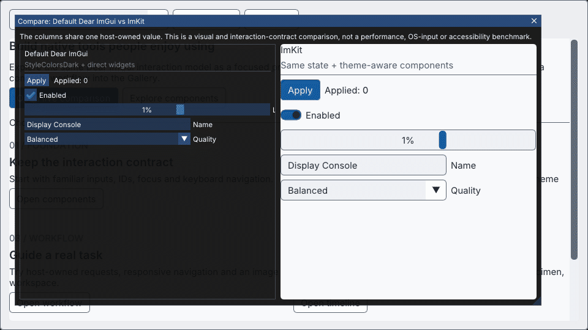
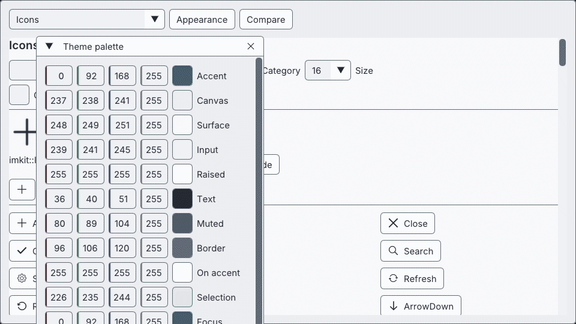
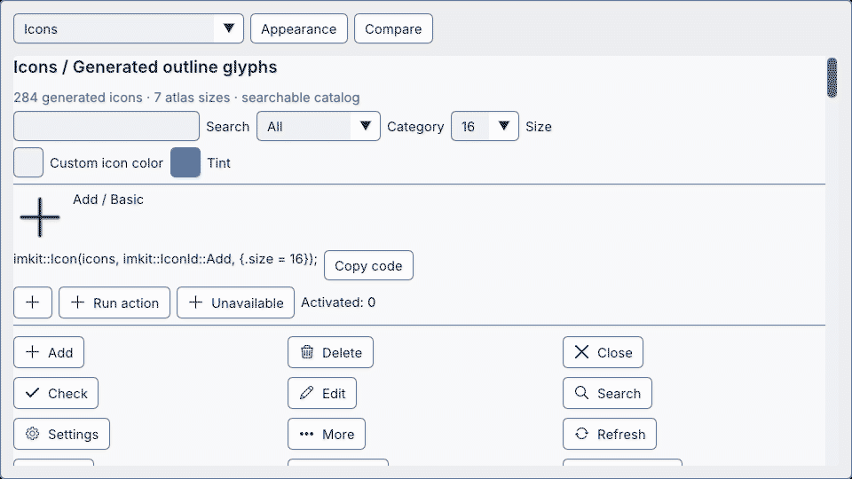
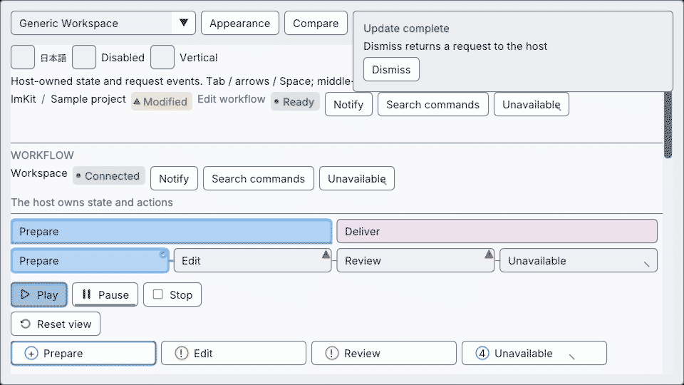
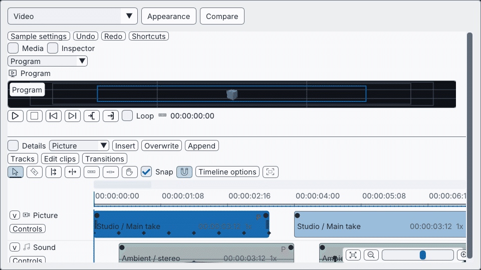

# imgui-modern-kit

[日本語](README.ja.md) · [Getting started](docs/getting-started.md) · [Gallery guide](docs/gallery.md) · [Release notes](CHANGELOG.md)

## ✨ Make the tool feel as intentional as the work

**ImKit v2.2.0** is a C++20 design layer for Dear ImGui. It adds a coherent visual system, reusable controls, semantic themes, generated icons and optional editor surfaces—while the host keeps its context, renderer, data and workflow.

MIT licensed · static library · Windows x64/MSVC verified · Dear ImGui `v1.92.9b-docking` baseline

> 🪟 **Try the Gallery first.** Download the [Windows x64 Gallery](https://github.com/AokiMotohide/imgui-modern-kit/releases/download/v2.2.0/imkit-2.2.0-gallery-windows-x64.zip), unzip it, then run `imkit_gallery.exe`. No installer, no application code required.

## 🎞 Explore the native Gallery

Every animation below is captured from the native Gallery. The first two make the choice concrete: the movable **Compare** window puts direct Dear ImGui next to ImKit, and both columns edit the *same host-owned values*.

| | |
|---|---|
| <br>**Start with a clear route**<br>Open comparison, components, workflow or the editor examples without facing an empty demo. | <br>**Compare the same interaction**<br>Direct `StyleColorsDark` widgets and ImKit controls update one shared value. |
| <br>**Move through 12 complete themes**<br>Inspect palette and semantic-state changes in the running UI. | <br>**Search 284 generated icons**<br>Seven pixel sizes and 1,988 atlas variants keep a large catalog practical. |
| <br>**Guide a real workflow**<br>Show host-owned requests, notifications and state feedback without adding a framework. | <br>**Scale into editing surfaces**<br>Explore timeline interaction and undo as a Gallery specimen. |

This is a real OpenGL-backbuffer capture, not a redrawn mockup. It demonstrates visual structure and interaction-contract continuity; it is **not** a performance, native OS/IME or accessibility benchmark. The comparison introduces no copied third-party UI code or assets.

## 🚀 Built to evolve

ImKit evolves through versioned releases rather than a one-off visual refresh. The Gallery, reproducible GIFs, SDK manifests and English/Japanese documentation are updated together, so you can evaluate each improvement from a native executable before adopting it. Follow [Releases](https://github.com/AokiMotohide/imgui-modern-kit/releases) and the [changelog](CHANGELOG.md) for the current line and its evidence.

## Get value in 30 seconds

Build the Gallery from source:

```powershell
cmake --preset windows-debug
cmake --build --preset windows-debug --target imkit_gallery --parallel
./build/windows-debug/catalog/Debug/imkit_gallery.exe
```

The first screen gives a guided route into the comparison, components, themes, workflow and frame lab. Every screen keeps the host-ownership boundary visible, so examples do not silently turn into a framework dependency.

Add ImKit to an existing Dear ImGui host:

```cmake
# host_imgui contains the matching Dear ImGui core sources.
set(IMKIT_IMGUI_TARGET host_imgui)
add_subdirectory(external/imgui-modern-kit)
target_link_libraries(your_app PRIVATE imkit::imkit)
```

```cpp
#include <imkit/imkit.h>

auto theme = imkit::MakeTheme(imkit::ThemePreset::Ocean);
imkit::ApplyTheme(theme); // after context creation, before NewFrame

// Inside the host frame:
if (imkit::Begin("Display")) {
    static bool enabled = true;
    imkit::Toggle("Enabled", &enabled, {&theme});
    imkit::ActionButton("Apply", imkit::ActionVariant::Primary, {}, {&theme});
}
imkit::End(); // required even when Begin returns false
```

## Keep the parts that make your application yours

ImKit deliberately does **not** create or own:

- Dear ImGui contexts, backends, renderer or frame loop
- Font atlas, textures, GPU resources or platform windows
- Edited values, scene/media data, undo history, persistence or workers

Dear ImGui continues to own IDs, focus, keyboard navigation, callbacks, clipping and text editing. ImKit is a design and component library—not a renderer, application framework or Dear ImGui fork.

## Pick only what you need

| Target | Best for | Dependency boundary |
|---|---|---|
| `imkit::imkit` | themes, native wrappers, controls, icons and workflow patterns | your compatible Dear ImGui target |
| `imkit::editor_core` | canvas, selection, splitters and editor data-view contracts | `imkit::imkit` |
| `imkit::video`, `imkit::cg`, `imkit::editor_suite` | optional advanced editor examples | `imkit::editor_core` |
| `imkit::preview_opengl3` | explicitly constructed preview helper | host-provided OpenGL context/function table |
| `imkit::window_frame_win32` / `imkit::window_frame_macos` | optional borrowed native-window adapters | matching platform libraries only |

Source integration is recommended. The Windows SDK archive is available for the verified compiler/CRT/ImGui ABI combination; the Gallery uses GLFW and OpenGL only as a development executable and never adds them to `imkit::imkit` consumers.

## ✅ Know what is verified

The supported baseline is Dear ImGui `v1.92.9b-docking` at `b48d1afbe8ee8b238e2961dc363a949dd7304e23`, on Windows x64/MSVC. The native Gallery captures are reproducible from checked-in code. Public-IO verification covers the shared-state comparison and gallery workflows; native OS/IME input, assistive technology, other platforms and acceptance in a particular host application remain separate work.

```powershell
cmake --build --preset windows-debug --target imkit_theme_test imkit_workflow_test --parallel
ctest --test-dir build/windows-debug -C Debug -R "imkit.(theme|workflow)" --output-on-failure
./build/windows-debug/catalog/Debug/imkit_gallery.exe --verify-comparison --output out/comparison
```

Read the full [validation record and limits](docs/validation.md) before expanding the compatibility claim.

## 📚 Continue with the right document

| Need | English | 日本語 |
|---|---|---|
| Install and first frame | [Getting started](docs/getting-started.md) | [導入ガイド](docs/getting-started.ja.md) |
| Gallery, controls and reproducible GIFs | [Gallery guide](docs/gallery.md) | [Gallery ガイド](docs/gallery.ja.md) |
| Themes, fonts and scale | [Themes](docs/themes.md) | [テーマ](docs/themes.ja.md) |
| Components and recipes | [Components](docs/components.md) | [コンポーネント](docs/components.ja.md) |
| Architecture and host ownership | [Architecture](docs/architecture.md) | [Architecture](docs/architecture.md) |
| API and troubleshooting | [API coverage](docs/api-coverage.md) · [Troubleshooting](docs/troubleshooting.md) | [API coverage](docs/api-coverage.md) · [トラブルシューティング](docs/troubleshooting.ja.md) |

## License and provenance

ImKit is [MIT licensed](LICENSE). Dear ImGui, GLFW and optional font assets retain their own licenses; versions, hashes, font provenance and distribution notices are in [THIRD_PARTY_NOTICES.md](THIRD_PARTY_NOTICES.md). The Gallery comparison and GIFs add no third-party image, icon, font or code asset.
