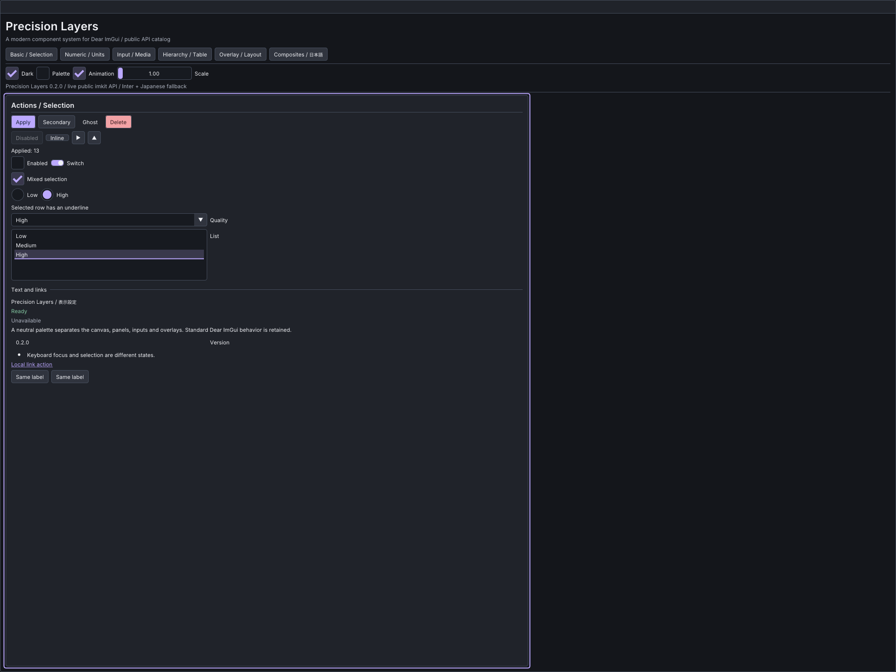

# imgui-modern-kit

[日本語](README.ja.md) · [User guide](docs/guide.md) · [API coverage](docs/api-coverage.md) · [Release v0.2.0](https://github.com/AokiMotohide/imgui-modern-kit/releases/tag/v0.2.0)

**Precision Layers** is a modern, compact design system for Dear ImGui: neutral layered surfaces, 28 px controls, 6 px spacing, 4 px corners, restrained borders, clear selection marks, and distinct action variants. Light and dark palettes are editable values.

ImKit is a **C++20 static extension library**, not a runtime plugin or a replacement renderer. It exposes the current public GUI API through exact native overload sets and a small set of decorated wrappers. The theme styles native rendering; composite controls add switches, mixed selection, segments, searchable selection, unit inputs, settings rows, badges, notifications and toolbars. See the [overload-level inventory](docs/api-coverage.md) for implementation boundaries.



## Quick start

Supported baseline: **Dear ImGui v1.92.9b-docking**, commit `b48d1afbe8ee8b238e2961dc363a949dd7304e23`. Other revisions are rejected rather than silently treated as ABI compatible. Source integration is the recommended route.

```cmake
# host_imgui already contains your matching Dear ImGui core sources.
set(IMKIT_IMGUI_TARGET host_imgui)
add_subdirectory(external/imgui-modern-kit)
target_link_libraries(your_app PRIVATE imkit::imkit)
```

```cpp
#include <imkit/imkit.h>

// Keep this value in the host; save/copy it as your application requires.
auto theme = imkit::MakePrecisionTheme(imkit::ColorScheme::Dark);
imkit::SetAccent(theme, ImVec4(0.53f, 0.79f, 0.73f, 1.0f));

// After the host creates its context; before NewFrame:
imkit::ApplyTheme(theme);
// Inside the host's frame:
if (imkit::Begin("Settings")) {
    static bool enabled = true;
    imkit::Checkbox("Enabled", &enabled);
    imkit::ActionButton("Apply", imkit::ActionVariant::Primary, {}, {&theme});
}
imkit::End(); // Required even when Begin() returns false.
```

The host owns context, frame lifecycle, font atlas, renderer, IDs and edited values. ImKit does not create contexts, load fonts, search operating-system paths, persist settings or start threads. Library-only integration creates no GLFW/OpenGL/capture targets and downloads nothing.

## Catalog and build

On Windows with Visual Studio 2026 C++ and a CMake version supporting its generator:

```powershell
cmake --preset windows-debug
cmake --build build/windows-debug --config Debug --target imkit_gallery imkit_api_compile imkit_context_smoke
./build/windows-debug/catalog/Debug/imkit_gallery.exe
```

The catalog uses shipped APIs in six categories and includes Japanese text, palette editing and scale. `--capture --output out/catalog` captures actual OpenGL frames; `--verify` runs representative public IO interactions. The optional `IMKIT_BUILD_DESIGN_GALLERY` target preserves earlier design comparisons; it is not the production catalog.

## Installation and distribution

The release provides a source archive and a Windows x64 SDK containing separate Debug/Release static libraries, CMake config, manifest and SHA256SUMS. The SDK requires the exact documented compiler/CRT/ImGui configuration. See [installed consumption](docs/guide.md#installed-sdk). Do not combine arbitrary ImGui binaries with it.

Documentation: [guide](docs/guide.md), [architecture](docs/architecture.md), [API coverage](docs/api-coverage.md), [validation and limitations](docs/validation.md), [changelog](CHANGELOG.md).

## License

ImKit code is MIT. Dear ImGui and GLFW have their own licenses; optional Inter and Noto Sans JP catalog fonts use SIL OFL 1.1. Complete records and pinned hashes are in [THIRD_PARTY_NOTICES.md](THIRD_PARTY_NOTICES.md). No affiliation with Dear ImGui or the design references is implied.
## Modern icons

133 generated outline icons support theme tint, custom color, size, icon buttons and
label buttons. GPU textures remain host-owned. See [icon integration](docs/icons.md)
and the **Icons** page in the native Gallery.

## Editor Suite development

Experimental `editor_core`, `video`, `cg`, `preview_opengl3` and `editor_suite` targets are available. The native Gallery contains Video and CG workspaces. **The requested 1.0 feature set is not complete.** See [module contracts and remaining work](docs/editor-suite.md), [API reference](docs/editor-api.md) and [validation](docs/editor-validation.md).
