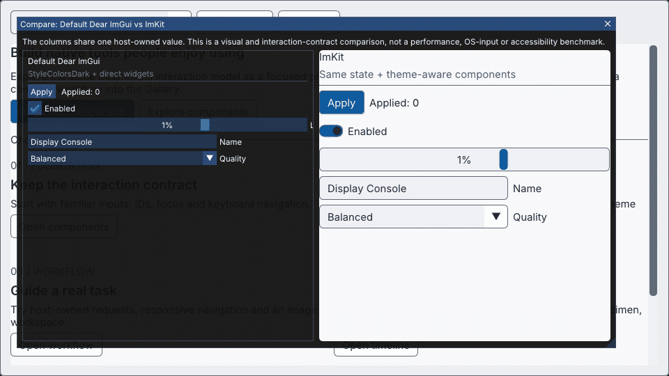

# imgui-modern-kit

[日本語](README.ja.md) · [Getting started](docs/getting-started.md) · [Themes](docs/themes.md) · [Components](docs/components.md) · [Gallery](docs/gallery.md)

**A modern, native design layer for Dear ImGui.** ImKit gives C++ tools a coherent visual system, reusable controls, semantic themes, generated icons and advanced editor surfaces without taking ownership away from the host application.

MIT licensed · C++20 · static library · pinned Dear ImGui baseline



## Why ImKit

- **Designed, not merely recolored.** Layered surfaces, clear hierarchy, compact metrics and semantic states work across standard controls and composed components.
- **Native behavior stays native.** Dear ImGui still owns IDs, focus, navigation, callbacks, clipping and text editing. ImKit does not replace the renderer or frame lifecycle.
- **Small controls scale into serious tools.** Start with buttons, settings rows and validation; compose them with icon, timeline, graph and 3D workspace APIs when needed.

## 30-second start

Supported baseline: **Dear ImGui v1.92.9b-docking**, commit `b48d1afbe8ee8b238e2961dc363a949dd7304e23`. Source integration is recommended.

```cmake
# host_imgui already contains the matching Dear ImGui core sources.
set(IMKIT_IMGUI_TARGET host_imgui)
add_subdirectory(external/imgui-modern-kit)
target_link_libraries(your_app PRIVATE imkit::imkit)
```

```cpp
#include <imkit/imkit.h>

auto theme = imkit::MakeTheme(imkit::ThemePreset::Ocean);
imkit::ApplyTheme(theme); // after context creation, before NewFrame

// Inside the host frame:
if (imkit::Begin("Display")) {
    static bool enabled = true;
    imkit::Toggle("Enabled", &enabled, {&theme});
    imkit::ActionButton("Apply", imkit::ActionVariant::Primary, {}, {&theme});
}
imkit::End(); // required even when Begin returns false
```

The host owns contexts, backends, fonts, renderer, frame lifecycle, IDs, edited data and persistence. ImKit creates none of them and starts no worker threads.

## Before you adopt it

ImKit is a **static C++20 UI library**, not an application framework or a Dear ImGui fork. It gives a host-created Dear ImGui context themed, native controls and optional editor-oriented modules. Your application remains responsible for its renderer, backend, data model, undo/history, persistence, fonts and frame loop.

| Question | Current answer |
|---|---|
| Supported baseline | Dear ImGui `v1.92.9b-docking` at `b48d1afbe8ee8b238e2961dc363a949dd7304e23`; Windows x64/MSVC is the verified environment. |
| Core dependency | The consumer supplies a compatible Dear ImGui target. The base `imkit` target does not bring in GLFW, OpenGL or a renderer. |
| Optional development dependencies | GLFW and OpenGL3 are used only to build the native Gallery; they are not linked into a normal consumer. |
| Ownership and data | ImKit keeps no global selected theme, persisted settings, worker or application data. `Theme`, fonts and edited values remain host-owned. |
| What is not claimed | Other Dear ImGui revisions, platforms, native OS/IME behavior, assistive technology and a specific host application's acceptance are not implicitly verified. |

This boundary is deliberate: it keeps integration predictable in existing tools. Read the [architecture and ownership rules](docs/architecture.md) before using the Editor modules.

## Twelve discoverable themes

Use `PrecisionLight`, `PrecisionDark`, `Graphite`, `Midnight`, `Ocean`, `Forest`, `WarmSand`, `Rose`, `Violet`, `Solar`, `HighContrastLight` or `HighContrastDark`. The stable preset IDs are suitable for host-side persistence. `SetAccent` and direct `Theme` edits remain available for application-specific branding.

```cpp
for (const auto &preset : imkit::ThemePresets()) {
    // preset.id is stable for host-side persistence.
    ShowThemeChoice(preset.displayName, preset.id);
}
```

See [themes and customization](docs/themes.md) for contrast guarantees, font ownership and preset persistence.

## Components for native tools

ImKit includes action variants, switches, mixed selection, segmented controls, searchable selection, units, setting rows, validation, badges, notifications, toolbars and a tintable icon catalog. Standard Dear ImGui overloads remain available under the same applied theme.

Persistent application chrome and optional host-loaded Inter/Noto Sans JP assets are covered by [application shell components](docs/shell-components.md).

The Editor Suite demonstrates how the same contracts can support timelines, curves and 3D workspaces. It is an evolving advanced example; use its dedicated [module contracts](docs/editor-suite.md), [API reference](docs/editor-api.md) and [validation record](docs/editor-validation.md) instead of treating this README as its specification.

## Build the Gallery

```powershell
cmake --preset windows-debug
cmake --build --preset windows-debug --target imkit_gallery --parallel
./build/windows-debug/catalog/Debug/imkit_gallery.exe
```

The product-style Gallery starts with guided navigation, searchable use cases, live controls, copyable snippets, all theme presets and advanced editor examples. See [Gallery usage and capture](docs/gallery.md).

## Integration choices

- **Source:** preferred; provide the matching host ImGui target before `add_subdirectory`.
- **Installed SDK:** Windows x64/MSVC v145 with matching compiler, CRT, ImGui ABI and `imconfig.h` settings.
- **Library-only:** no GLFW, OpenGL, font or capture dependency is added to consumers.

Follow [Getting started](docs/getting-started.md) for both source and installed-package flows. Use [Troubleshooting](docs/troubleshooting.md) when configuration or ABI checks fail.

## Choose only the modules you need

| Target | Use it for | Depends on |
|---|---|---|
| `imkit::imkit` | Themes, native wrappers, components, icons, accessibility metadata and workflow patterns | Your Dear ImGui target |
| `imkit::editor_core` | Canvas, selection, splitters and editor data-view contracts | `imkit::imkit` |
| `imkit::video`, `imkit::cg`, `imkit::editor_suite` | Optional Video/CG editor examples and typed host events | `imkit::editor_core` |
| `imkit::preview_opengl3` | Explicitly constructed OpenGL3 preview helper | `imkit::cg`; host-provided context and GL function table |

The advanced modules are useful reference implementations, but they do not own scenes, media, selection, undo or GPU context. Their precise limits are in the [Editor contracts](docs/editor-suite.md).

## Verify what you cloned

The checked-in Gallery image is generated from native backbuffers, not a hand-drawn mockup. The source script, dependency versions and asset hashes are kept in the repository. To reproduce the normal Debug library and its focused public checks on the verified Windows baseline:

```powershell
cmake --preset windows-debug
cmake --build --preset windows-debug --target imkit_theme_test imkit_workflow_test --parallel
ctest --test-dir build/windows-debug -C Debug -R "imkit.(theme|workflow)" --output-on-failure
```

The complete evidence and explicit exclusions are maintained in [validation](docs/validation.md). A successful build or test does not expand the stated compatibility boundary.

## Documentation

| Need | English | 日本語 |
|---|---|---|
| Install and first frame | [Getting started](docs/getting-started.md) | [導入ガイド](docs/getting-started.ja.md) |
| Presets, accent, fonts, scale | [Themes](docs/themes.md) | [テーマ](docs/themes.ja.md) |
| Components and recipes | [Components](docs/components.md) | [コンポーネント](docs/components.ja.md) |
| Application shell and font assets | [Shell components](docs/shell-components.md) | [Shell部品](docs/shell-components.ja.md) |
| Gallery and real captures | [Gallery](docs/gallery.md) | [Gallery](docs/gallery.ja.md) |
| Common failures | [Troubleshooting](docs/troubleshooting.md) | [トラブルシューティング](docs/troubleshooting.ja.md) |
| Architecture and boundaries | [Architecture](docs/architecture.md) | [Architecture](docs/architecture.md) |
| Exact overload coverage | [API coverage](docs/api-coverage.md) | [API coverage](docs/api-coverage.md) |

## Compatibility and status

The verified baseline is Windows x64/MSVC with the pinned Dear ImGui docking revision. Other platforms and ImGui revisions are not silently claimed compatible. Native OS/IME behavior and integration into a particular application remain separate acceptance work. See [validation and limits](docs/validation.md).

The stable core, themes and components are documented here. Advanced editor modules continue to evolve behind explicit host-owned data and typed-event contracts.

## License

ImKit code is [MIT](LICENSE). Dear ImGui and Gallery-only dependencies retain their own licenses. Optional font sources, generated icon provenance, pinned revisions and file hashes are recorded in [THIRD_PARTY_NOTICES.md](THIRD_PARTY_NOTICES.md). The project does not imply endorsement or affiliation with the referenced design projects.

GroupedStepNavigator displays selectable groups above every step. IconToolbar wraps icon actions and presents selection, mixed state, disabled state and hover/focus descriptions. Both return requests and borrow host state and textures.
