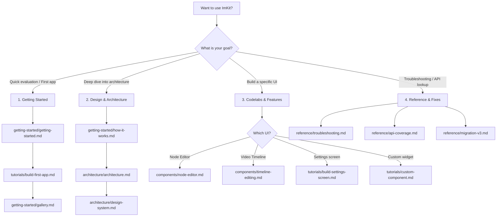

# ImKit documentation

[日本語](目次.md) · [Project overview](../README.md)

ImKit's documentation is organized in structured categories to help Dear ImGui developers quickly find what they need:

- **Getting Started (`getting-started/`)** — the mental model, ownership principles, installation, and usage guide.
- **Tutorials (`tutorials/`)** — runnable codelabs from your first themed window to full node editors and timelines.
- **Architecture (`architecture/`)** — authoritative ownership model, design tokens, themes, and dependencies.
- **Components (`components/`)** — detailed guides for individual components and modules.
- **Reference (`reference/`)** — API signatures, widget inventory, migration guides, and validation records.

For the complete bilingual page map, audience, and source mapping, see the [documentation catalog](reference/documentation-catalog.md). For practical recipes, see [examples and recipes](getting-started/examples-recipes.md).

---

## 🗺️ Learning Roadmap

---

## 📂 Documentation by Category

### Getting Started (`getting-started/`)
- [Getting started](getting-started/getting-started.md) — Prerequisites, CMake integration, and first calls.
- [User guide](getting-started/guide.md) — Host–library split, basic usage, and first themed controls.
- [How ImKit works](getting-started/how-it-works.md) — Ownership model, immediate mode frame loop, and Dear ImGui relation.
- [Gallery guide](getting-started/gallery.md) — Exploring the native Gallery and code locations.
- [Examples and recipes](getting-started/examples-recipes.md) — Practical code snippets and patterns.

### Tutorials (`tutorials/`)
- [Build your first ImKit app](tutorials/build-first-app.md) — Minimal host-owned application setup.
- [Build a settings screen](tutorials/build-settings-screen.md) — Host state, setting rows, and save/validation.
- [Build a node editor](tutorials/build-node-editor.md) — Graph snapshot in, edit requests out.
- [Build a timeline](tutorials/build-timeline.md) — Multi-track timeline, clips, and playhead.
- [Build a custom component](tutorials/custom-component.md) — Using `ThemeScope` and tokens for custom widgets.

### Architecture (`architecture/`)
- [Architecture](architecture/architecture.md) — Authoritative ownership model, module split, and host boundary.
- [Design system](architecture/design-system.md) — Semantic design tokens, typography, and contrast invariants.
- [Themes](architecture/themes.md) — 13 built-in presets, palette customization, and `ThemeScope`.
- [Icons](architecture/icons.md) — Procedural outline icons, multi-size atlases, and GPU upload.
- [Dependencies](architecture/dependencies.md) — Pinned Dear ImGui docking commit, compiler flags, and options.

### Components (`components/`)
- [Components](components/components.md) — Themed Dear ImGui controls and composite widgets.
- [Node editor](components/node-editor.md) — Snapshot/request node canvas and editor widgets.
- [Timeline editing](components/timeline-editing.md) — Track actions, roll/slide gestures, and external drop.
- [Editor suite](components/editor-suite.md) — Professional workspace modules (Core, Video, CG).
- [Workflow components](components/workflow-components.md) — Multi-step workflows, wizards, feedback, and cards.
- [Shell components](components/shell-components.md) — Top chrome, header bars, and bottom action bars.
- [Window frame](components/gallery-window-frame.md) — Modern custom title bars and OS window frame integration.

### Reference (`reference/`)
- [Public API coverage](reference/api-coverage.md) — Full coverage table of Dear ImGui overloads.
- [Editor API](reference/editor-api.md) — Accurate signature reference for all Editor Suite modules.
- [Widget inventory](reference/widget-inventory.md) — Complete widget list and audit rationale.
- [Documentation catalog](reference/documentation-catalog.md) — Complete page index, audience, and source mapping.
- [Validation](reference/validation.md) — Automated gate and acceptance evidence.
- [Migration v3](reference/migration-v3.md) — Upgrading from ImKit v2 to v3.
- [Troubleshooting](reference/troubleshooting.md) — Solutions to common integration and build issues.

---

## 💡 The Core Mental Model: You Own Everything

There is only one essential principle to remember when using ImKit:

> **"You own everything; ImKit only draws and reports events."**

The Dear ImGui context, allocations, persistence, undo/redo history, and business models all belong strictly to **your host application**. ImKit never stores mutable document state or silently alters your data. Instead, it renders your models and returns typed requests that you validate and commit.

For details, see [How ImKit works](getting-started/how-it-works.md).
