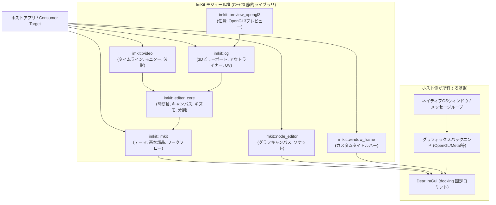

# アーキテクチャと設計方針

[English](architecture.md) · [目次](../目次.md) · [仕組みと設計思想](../getting-started/仕組みと設計思想.md)

ImKit は、Dear ImGui をベースにした制作ツール向け C++20 静的UIライブラリです。
本ドキュメントでは、ディレクトリ配置、レイヤー構成、プラットフォーム境界、テーマおよび状態の所有権モデル、そして拡張方針を定義します。

---

## モジュール構成と依存関係 (Layout)

公開ヘッダーは `include/imkit/`、実装コードは `src/`、自動テストは `tests/`、サンプルおよび検証用アプリケーションは `examples/gallery/` に明確に分離されています。

### レイヤー構造と責務一覧

| レイヤー / ターゲット | 公開ヘッダー | 主な責務・契約 | 依存先 |
|---|---|---|---|
| **コア基盤** (`imkit::imkit`) | `<imkit/imkit.h>`, `<imkit/theme.h>`, `<imkit/workflow.h>` | セマンティックテーマ、基本部品（ボタン、トグル、バッジ等）、ステップ進行、トースト通知 | Dear ImGui |
| **エディタコア** (`imkit::editor_core`) | `<imkit/editor_core.h>` | 時間軸ルーラー（Tick）、共通キャンバス、セレクション管理、スプリッター | `imkit::imkit` |
| **タイムライン** (`imkit::video`) | `<imkit/video.h>` | マルチトラックタイムライン、クリップ編集（トリム/ロール/スライド）、波形表示 | `imkit::editor_core` |
| **3D / CG** (`imkit::cg`) | `<imkit/cg.h>`, `<imkit/preview.h>` | 3Dビューポート、トランスフォームギズモ、アウトライナー、UVエディタ | `imkit::editor_core` |
| **ノードエディタ** (`imkit::node_editor`) | `<imkit/node_editor.h>` | スナップショット/リクエスト方式のノードグラフ描画、動的ソケット | Dear ImGui |
| **ウィンドウ枠** (`imkit::window_frame`) | `<imkit/window_frame.h>` | タイトルバー描画、OS別アダプター（Win32 / macOS）連携 | `imkit::imkit` |

---

## プラットフォーム境界 (Platform boundary)

- **バックエンド非依存**: ImKit コアは特定の描画バックエンド（DirectX、Vulkan、Metal、OpenGL）に依存しません。公式バックエンドのコンパイルとリンクはホスト側（または Gallery サンプル）が行います。
- **GPU リソースの借用**: 任意のプレビューターゲット（`preview_opengl3`、`preview_metal`）は、オフスクリーンGPUテクスチャの描画のみを管理し、デバイス、コンテキスト、コマンドバッファのライフサイクルはホストが所有します。
- **OS アクセシビリティ**: `accessibility_win32` および `accessibility_macos` はセマンティックスナップショットを借用し、操作要求を `NativeActionSink` を通じてホストへ返却します。

---

## テーマと状態管理のルール (Theme and state)

- **ホスト所有の原則**: Dear ImGui の Context、バックエンド、レンダラー、フォント、永続化（ini）、Undo履歴、バックグラウンド処理はすべてホストが管理します。
- **値型のテーマ**: `imkit::Theme` は値型の構造体であり、グローバルシングルトンではありません。
- **`ThemeScope` の寿命**: 一時的なテーマ適用を行う `ThemeScope` は、生成された Context と同じスレッドおよび寿命内で破棄される必要があります。

---

## 拡張方針 (Extension policy)

- **Dear ImGui 規約の維持**: 新規オーバーロードを追加する際は、元のデフォルト値、引数順、戻り値のセマンティクスを完全に維持します。
- **寸法の導出**: コントロールの寸法はハードコードせず、テーマのトークンとフォントサイズから動的に計算します。
- **ホスト固有ロジックの排除**: 特定のファイル形式、通信プロトコル、ビジネスロジックはライブラリに含めず、汎用UIパーツとして設計します。

---

## エディタモジュールの所有権 (Editor module ownership)

- **非所有ポインタの徹底**: プロバイダーが返却するデータやテキストは借用参照です。
- **ジェスチャとリクエスト**: タイムラインやノードエディタの操作は、ドラッグ中のプレビューと確定（Commit）を明確に区別し、ホストが受理した変更のみリビジョンを更新します。
- **固定バッファ**: イベントバッファや選択ストレージはホスト側がサイズを指定して提供し、暗黙の動的ヒープ確保を行いません。
