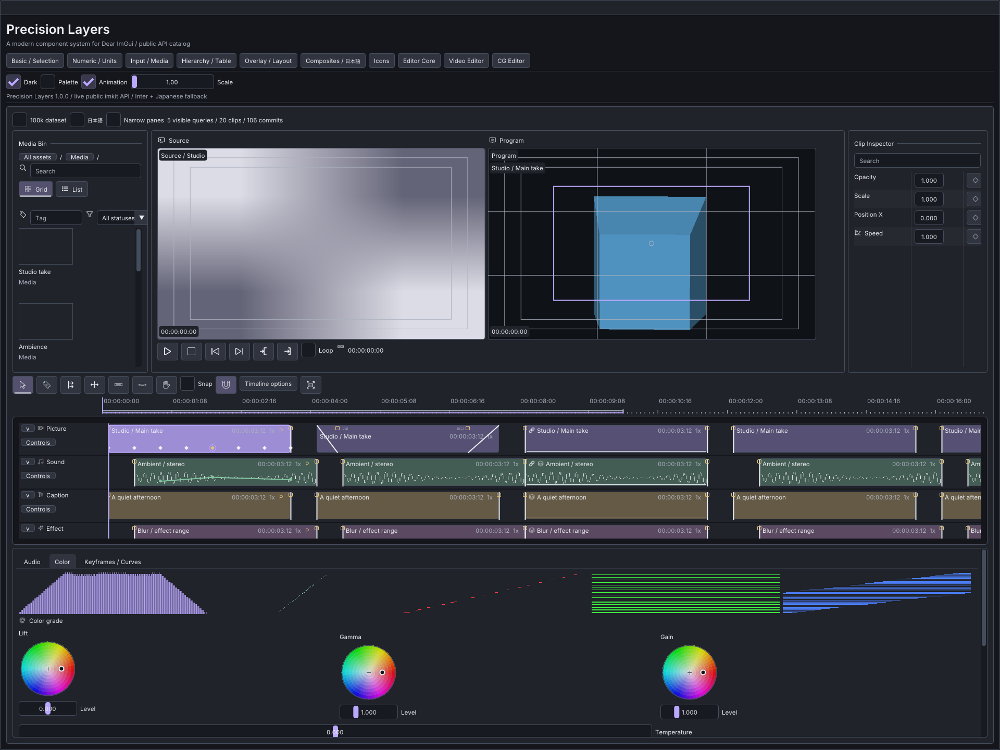
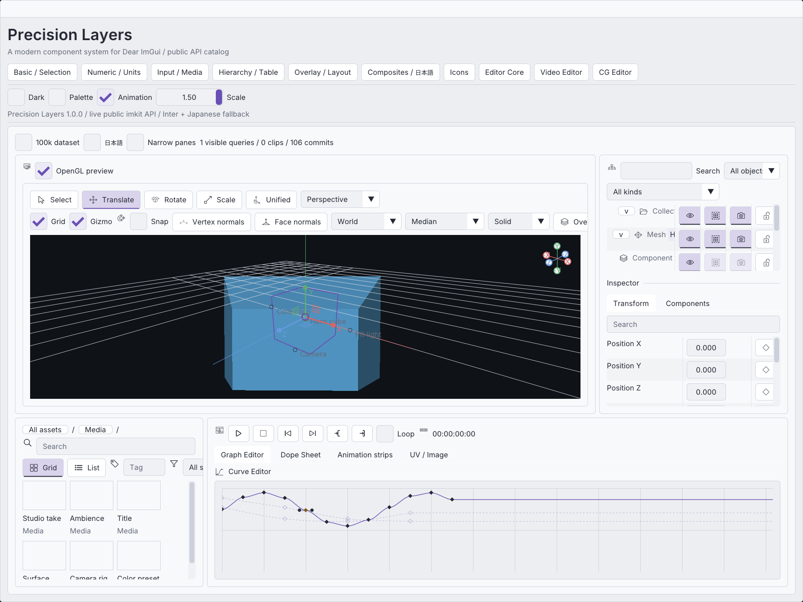

# Editor Suite 1.0

ImKit provides reusable C++20 editor controls on Dear ImGui 1.92.9b-docking.
ImKitはDear ImGui 1.92.9b-docking上の再利用可能なC++20編集部品です。

## Modules / module構成

| Target | Header | Role / 役割 |
|---|---|---|
| `imkit::imkit` | `imkit/imkit.h` | Native wrappers, Precision Layers theme, icons / 基本部品・Theme・icon |
| `imkit::editor_core` | `imkit/editor_core.h` | Canvas, time, curves, property/asset controls / 共通編集基盤 |
| `imkit::video` | `imkit/video.h` | Timeline, monitors, audio, color / 動画編集UI |
| `imkit::cg` | `imkit/cg.h`, `imkit/preview.h` | Viewport, hierarchy, animation, UV, DrawList preview / CG編集UI |
| `imkit::editor_suite` | Module headers above / 上記header | Core + Video + CG, without mandatory OpenGL / OpenGLを必須にしない集約 |
| `imkit::preview_opengl3` | `imkit/preview.h` | Optional host-context renderer / 任意の描画module |

## Ownership and events / 所有権とイベント

The host owns Context, backend, fonts, textures, source data, providers, UI state,
selection, undo, persistence and workers. Spans and UTF-8 label pointers are borrowed
for each call. StableId is a unique nonzero uint64_t; times use int64_t Tick at
705600000 ticks/second with rational FrameRate, including negative pre-roll and
29.97/59.94 drop-frame timecode. Parsing accepts two-digit hour fields.

Context・backend・font・texture・元データ・provider・UI状態・選択・Undo・保存・workerは
ホスト所有です。spanとUTF-8ラベルは呼出し中に有効な非所有参照です。StableIdは一意かつ
非ゼロのuint64_t、時間は毎秒705600000のint64_t Tickと有理数FrameRateを使います。
負のpre-roll、29.97/59.94 drop-frameに対応し、時フィールドの解析は2桁です。

Continuous model edits emit Begin/Update/Commit/Cancel with revision, original and
proposed values. Apply preview separately, increment revision on accepted commits
or external changes, and cancel stale gestures. A full event or scratch buffer sets
overflow. Terminal intent is retained for retry; related edits reserve the complete
batch and reject locked members together. Instant context actions carry typed
Commit events. Navigation ranges and display options are mutable host UI state.

連続編集はrevision・元値・提案値付きのBegin/Update/Commit/Cancelを返します。previewは
確定値と分け、確定または外部変更でrevisionを進めます。容量不足はoverflowで通知し、
終端の意図を保持して再送します。関連対象はbatch全体の容量とlockを確認します。
即時context操作は型付きCommitを返し、移動範囲・表示設定はホストのUI状態を更新します。

Visible providers bound steady-frame work. Complete selected-member and neighbor
queries run when needed for editing. Keep IDs stable across sorting and filtering.
All keyboard presets route through host-owned Command bindings; canvas interaction
stays inside the focused widget. See [API contracts](editor-api.md) for event payloads,
query completeness, scratch sizes and overloads.

定常フレームは可視範囲providerで処理量を制限し、編集時に選択対象全体・隣接要素を取得します。
並べ替え・絞り込みでもIDを維持してください。キー設定はホスト所有Command bindingを使います。
イベントpayload、queryの完全性、scratch容量、overloadは[API契約](editor-api.md)を参照してください。

## Editor controls / 編集部品

Core supplies canvas pan/zoom/fit, box/lasso selection, time ruler and editable ranges,
marker edits, transport, multi-key curves and Bezier handles, property states and array
reorder, numeric copy/paste, and filtered/renamable asset grid/list views.

Coreはcanvas移動・拡大・fit、矩形/投げ縄、時間軸・範囲・marker編集、transport、複数keyと
Bezier handle、property状態・配列並べ替え・数値copy/paste、素材の検索・一覧・名前変更を提供します。

Video supplies variable-height role tracks, restrictions/source/target controls,
related clip moves and trims, split/ripple/roll/slip/slide/ripple-delete, snap targets,
transition overlap/type/duration, captions and property keys. Monitor overlays use
host textures. PCM buckets, envelope/mixer controls and CPU RGB/luma/vector scopes
are separate from playback. Three-way wheels and RGB CurveEditor edits apply to
synthetic host data; ApplyColorCurves evaluates normalized RGB and preserves alpha.

Videoは可変高track、制限・source/target、関連clipの移動・trim・split・ripple・roll・slip・
slide・ripple削除、snap、transition、caption、property keyを提供します。Monitorはホストtextureを
使用します。PCM bucket・envelope/mixer・CPU scopeは再生engineと分離しています。three-way wheelと
RGB CurveEditorを合成ホストデータへ適用し、ApplyColorCurvesはalphaを保ってRGBを評価します。

CG supplies camera/navigation/shading/overlays, restricted hierarchy selection and
reparent/reorder, oriented multi-object gizmos with explicit affine scale/shear,
component/modifier rows, graph/dope-sheet/strip controls, and UV vertex/edge/face/island
selection and transforms with normalized/pixel/UDIM coordinates and pin/seam overlays.

CGはcamera・navigation・shading・overlay、階層選択・制限・親変更・並べ替え、方向とpivotを
反映する複数object gizmo、明示的なアフィンscale/shear、component/modifier、graph/dope sheet/strip、
UVのvertex/edge/face/island編集とnormalized/pixel/UDIM座標・pin/seam表示を提供します。

## Preview lifecycle / Previewの寿命

DrawList preview projects non-owning indexed mesh spans into host triangle scratch,
then depth-sorts them. Cube, Sphere, CameraPrimitive and LightPrimitive fill host
buffers. It has no z-buffer; intersecting/cyclic surfaces and occluded outline edges
can be approximate. Both renderers use the affine inverse-transpose normal transform.

DrawList previewは非所有meshとホストscratchを使い、三角形をdepth sortします。
Cube・Sphere・CameraPrimitive・LightPrimitiveはホストbufferへ生成します。z-bufferを持たず、
交差・循環する面や隠れたoutlineは近似です。両rendererはアフィン逆転置normalを使用します。

The OpenGL3 object owns FBO/color/ID/depth textures, shaders, VAO and buffers. The host
supplies GLFunctions and a current OpenGL 3.3 context for Init/Resize/Render/Pick/Shutdown.
Call Shutdown before destroying that context; the destructor makes no GL calls.
Resize replaces texture IDs. Pick returns the full uint64_t ID, zero for background.
Rendering changes GL bindings, viewport, depth/cull/blend/scissor/polygon state and
ends with framebuffer/program/VAO zero. The host restores state for later passes.

OpenGL3 objectはFBO・color/ID/depth texture・shader・VAO・bufferを所有します。ホストが関数表と
current OpenGL 3.3 Contextを渡し、破棄前にShutdownします。デストラクタはGLを呼びません。
Resize後はtexture IDを取得し直します。Pickは64bit ID、背景は0です。描画はGL binding、viewport、
depth/cull/blend/scissor/polygon状態を変更し、終了時FBO/program/VAOは0です。後続passの状態は
ホストが復元します。

## Native Gallery / 操作例

Pages 7/8/9 use public Core/Video/CG APIs and apply edits in the sample host. Context
menus expose secondary actions; range endpoints and timeline track names have their
own menus. Color/Inspector panes scroll when compact. The 100k toggle creates 256
tracks, 100096 clips and 100000 keys. The transition history menu demonstrates host
Undo/Redo. Icons are host-uploaded atlases: 120 preserved IDs plus 86 additions.

Galleryの7/8/9ページは公開APIを使い、sample hostへ編集結果を適用します。補助操作は右クリック、
範囲端点とtrack名にも専用menuがあります。狭いColor/Inspectorはスクロールできます。100k切替は
256 track・100096 clip・100000 keyです。transition履歴menuはホストUndo/Redoの例です。
アイコンはホストがatlasをuploadし、既存120 IDを保持して86種類を追加しています。

`imkit_gallery.exe --list-monitors` lists displays; `--monitor N` places the native
window on a selected display, including hidden capture runs. This is useful with
DisplayLink/multiple-adapter desktops. It does not change system display settings.

`--list-monitors`で画面を列挙し、`--monitor N`でcaptureを含むnative windowの配置先を指定できます。
DisplayLinkなど複数adapter環境で使用でき、OSの画面設定は変更しません。

## Scope / 対象範囲

This is an editor UI suite, not a media decoder/player, resampler, color-management
engine, node editor, UV unwrapper, IK/simulation/animation runtime, PBR/shadow renderer
or file-format loader. Native OS/IME and real-project integration are not inferred
from public ImGui IO or GPU tests. See [validation](editor-validation.md).

本製品の対象は編集UIです。media decode/再生、resample、本格色管理、node editor、UV unwrap、
IK/simulation/animation runtime、PBR/shadow、形式loaderは対象外です。native OS/IMEや実project統合を
公開ImGui IO・GPUテストの合格から推定しません。[検証結果](editor-validation.md)を参照してください。
