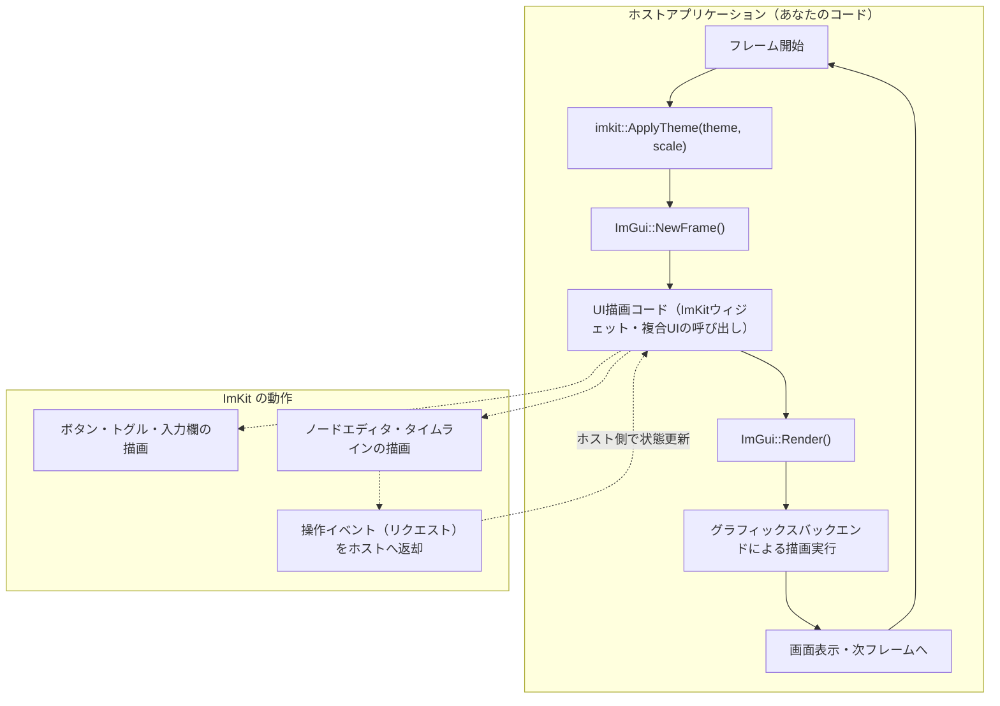
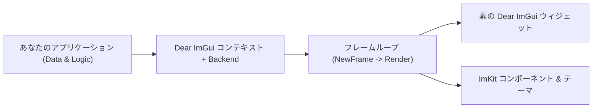

# ImKit の仕組みと設計思想

[English](how-it-works.md) · [目次](../目次.md) · [利用ガイド](利用ガイド.md)

ImKit は Dear ImGui の**上**に重ねて使用するUIライブラリであり、Dear ImGui を置き換えるものではありません。
ImKit をスムーズに活用するために最も重要なのは、Dear ImGui の即時モード（Immediate Mode）フレームサイクルがどのように動作し、**「何がホスト（利用側アプリ）の所有で、何が ImKit の責務なのか」** というメンタルモデル（概念の理解）を把握することです。

公式・網羅的な所有権やアーキテクチャ仕様については [アーキテクチャ](../architecture/アーキテクチャ.md) を参照してください。

---

## ImKit が提供するもの・しないもの

ImKit は C++20 で書かれた静的ライブラリです。

### ImKit が行うこと（責務）
- Dear ImGui 標準のウィジェットを再利用し、モダンなテーマとスタイリングで拡張する（`imkit::imkit`）。
- 専門性の高い複合コンポーネントを提供する：ノードエディタ、ビデオタイムライン、ワークフローパネル、タイトルバー外装。
- 統一されたテーマプリセット、280種以上のベクターアイコン、デザイントークンを提供する。

### ImKit が行わないこと（ホスト側の責任）
- Dear ImGui コンテキスト、描画バックエンド（GLFW/OpenGL/DirectX/Metal等）、メインフレームループの初期化や所有。
- 動画や音声のデコード・再生、シミュレーション処理、業務データの保持。
- ファイルや設定の永続化、Undo/Redo 履歴の管理。

この責務分離は意図的な設計です。ImKit は Dear ImGui のコアメカニズムを所有しないため、すでに Dear ImGui コンテキストを持つ既存のアプリケーションにそのまま組み込むことができます。ホストアプリ側が持つアーキテクチャやデータフローを破壊することはありません。

---

## 即時モード（Immediate Mode）とフレームループ

Dear ImGui は**即時モード（Immediate Mode）**を採用しています。毎フレーム、アプリケーションは画面全体のUIをゼロから再描画します。基本的な処理の流れは次の通りです：

1. フレームループ内で `ImGui::NewFrame()` を呼び出します。
2. 任意の順序で描画関数を呼び出します（ImKitのウィジェットもこの中で描画します）。
3. `ImGui::Render()` を呼び出し、蓄積された描画コマンドをグラフィックスバックエンドへ渡します。
4. 次のフレームが開始すると、再びゼロから描画が繰り返されます。



永続的なウィジェットのオブジェクトツリーはメモリ上に保持されません。毎フレームの関数呼び出しによってUIが構築されます。そのため、状態（テキスト、選択状態、フラグ等）は**フレームループの外側**（あなたのアプリのデータモデル）で保持し、毎フレーム参照・更新します。

---

## ホストと ImKit のレイヤー構造


ImKit は、既存の Dear ImGui フレームの中で呼び出される、洗練されたウィジェットと複合部品の薄いレイヤーです。



ImKit の関数呼び出しは、**現在アクティブな** Dear ImGui コンテキストに対して描画コマンドを発行します。自らコンテキストを作成することはなく、フレームを超えて生存するUIインスタンスも持ちません。

---

## 誰が何を所有するか（所有権モデル）

開発者が最も意識すべき黄金律です：

> **「ホストがすべてのデータとコンテキストを所有し、ImKit は描画とイベントの報告のみを行う」**

| 対象 | 所有者 | 備考 |
|---|---|---|
| Dear ImGui コンテキスト、バックエンド、フレームループ | **ホスト** | ImKit は一切初期化・破棄を行いません |
| フォントおよびフォントアトラス | **ホスト** | フォントテクスチャの生成・解放はホストが管理 |
| 表示・編集対象のビジネスデータ（グラフ、メディア、設定等） | **ホスト** | ImKit は内部にデータをコピー・保持しません |
| 選択状態、Undo/Redo 履歴、ファイルの保存 | **ホスト** | 編集履歴の管理は完全にホストの自由です |
| テーマ設定（`Theme`）と適用タイミング | **ホスト** | 毎フレーム開始前にホストが明示的に適用 |
| 画面への描画コマンド（DrawListへの発行） | **ImKit** | ホストから渡されたデータに基づき描画 |
| 操作結果（クリック、ドラッグ、ノード接続など） | **ホスト** | ImKit から返された要求（Request）をホストが処理 |

ImKit から何か情報が返された場合（押されたボタンの真偽値、ドラッグされたタイムラインクリップ、ノードの接続要求など）、**あなたのコード側でその意味を解釈し、データモデルを更新**します。

---

## 1フレームのコード例（ステップ解説）

コピペしてそのまま構造を確認できる、最小限のフレーム実装例です：

```cpp
#include <imkit/imkit.h>
#include <imgui.h>

// 1. フレームループ外（初期化時）に一度だけ実行:
auto theme = imkit::MakeTheme(imkit::ThemePreset::PrecisionDark);

// アプリケーション固有の状態変数
bool showDemo = true;
float volume = 0.75f;

// 2. 毎フレーム実行されるループ:
while (!appShouldClose) {
    // 描画フレームの準備
    // ※ ApplyTheme は ImGui::NewFrame() の直前に呼び出します
    imkit::ApplyTheme(theme, 1.0f);
    ImGui::NewFrame();

    // UIの描画（ImKit の関数は ImGui 描画呼び出しの自然な拡張です）
    if (imkit::Begin("オーディオ設定")) {
        // ホスト側の bool 変数を直接読み書き
        imkit::ToggleButton("デモ音源を有効化", &showDemo);

        // スライダーによる数値変更
        ImGui::SliderFloat("音量", &volume, 0.0f, 1.0f);

        // ボタン押下時は true が返る（ホスト側でアクションを実行）
        if (imkit::ActionButton("設定を保存", imkit::ActionVariant::Primary)) {
            SaveAudioSettings(showDemo, volume);
        }
    }
    imkit::End();

    // レンダリング実行
    ImGui::Render();
    RenderDrawData(ImGui::GetDrawData());
}
```

### コードの重要ポイント
- **`ApplyTheme` のタイミング**: `ImGui::NewFrame()` の前に呼び出すことで、そのフレーム全体のウィジェットスタイルが確定します。
- **状態のバインディング**: `ToggleButton` にはホストのポインタ（`&showDemo`）を渡し、`ActionButton` のクリック検知は戻り値で即座にハンドリングします。
- **スコープの閉じ方**: `imkit::Begin()` で開いたスコープは、必ず対応する `imkit::End()` で閉じます。

---

## まとめ

- **ImKit は Dear ImGui の上に乗る薄いレイヤー**: コンテキストを作成・所有しません。
- **データはすべてホストが所有**: 毎フレームゼロから描画され、状態管理はホストアプリ側で行います。
- **ImKit は要求を返すだけ**: ユーザー操作に応じたデータの更新・Undo管理はアプリのロジックに委ねられます。

---

## 次に読むべきドキュメント

- **[導入ガイド](導入ガイド.md)** — CMake プロジェクトへの組み込みと環境要件。
- **[最初のアプリの作成](../tutorials/最初のアプリの作成.md)** — 完全な動作サンプルをステップバイステップで構築。
- **[アーキテクチャ](../architecture/アーキテクチャ.md)** — 所有モデルとモジュール境界の公式仕様。
