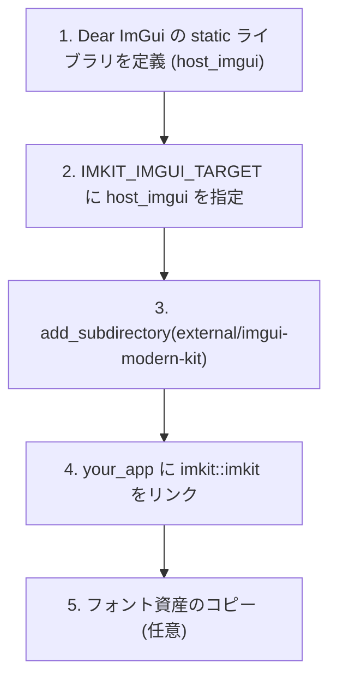

# 導入ガイド

[English](getting-started.md) · [目次](../目次.md) · [利用ガイド](利用ガイド.md)

ImKit は、ホストアプリケーションが用意した Dear ImGui 環境へ重ねて利用する C++20 静的ライブラリです。
ImKit 自身は Context、Renderer、Backend、フレームループを生成・所有しません。すでにお手元にある Dear ImGui プロジェクトへ直接組み込んでご利用いただけます。

---

## 必要環境

| 項目 | 要件 |
|---|---|
| **C++ 規格** | C++20 以上 |
| **Dear ImGui** | docking ブランチ commit `367b2c24f399988ddafc0bb4628da0106bcc09be`（1.93.0 WIP） |
| **ビルドシステム** | CMake 3.20 以降 |
| **コンパイラ / OS** | Windows x64 / Arm64 (MSVC 2022 以降)<br>macOS 15 以降 arm64 / x86_64 (Apple Clang) |

---

## 最短で動作を確認する（バイナリ配布）

環境に合う [v3.1.0 リリースパッケージ](https://github.com/AokiMotohide/imgui-modern-kit/releases/tag/v3.1.0) をダウンロードして展開してください：
- **Windows**: `bin/` 配下の `imkit_gallery.exe` および `imkit_node_editor_gallery.exe` を実行。
- **macOS**: 展開された `.app` バンドルを実行。
※ 両アーキテクチャ（Apple Silicon / Intel）共通で利用する場合は Universal 2 パッケージを選択してください。

---

## CMake によるソースコード組み込み（推奨）

既存の CMake プロジェクトに ImKit を組み込む基本的な流れです：



### `CMakeLists.txt` の記述例

```cmake
cmake_minimum_required(VERSION 3.20)
project(my_modern_app CXX)
set(CMAKE_CXX_STANDARD 20)

# 1. ホスト側で Dear ImGui ターゲットを作成
add_library(host_imgui STATIC
    ${IMGUI_SOURCE_DIR}/imgui.cpp
    ${IMGUI_SOURCE_DIR}/imgui_draw.cpp
    ${IMGUI_SOURCE_DIR}/imgui_tables.cpp
    ${IMGUI_SOURCE_DIR}/imgui_widgets.cpp
)
target_include_directories(host_imgui PUBLIC ${IMGUI_SOURCE_DIR})

# 2. ImKit が参照する ImGui ターゲット名を指定
set(IMKIT_IMGUI_TARGET host_imgui)

# 3. 不要なサンプルやテストのビルドを無効化
set(IMKIT_BUILD_GALLERY OFF CACHE BOOL "" FORCE)
set(IMKIT_BUILD_DESIGN_GALLERY OFF CACHE BOOL "" FORCE)
set(IMKIT_BUILD_TESTS OFF CACHE BOOL "" FORCE)

# 4. ImKit をサブディレクトリとして追加
add_subdirectory(external/imgui-modern-kit)

# 5. アプリケーションにリンク
add_executable(my_app src/main.cpp)
target_link_libraries(my_app PRIVATE imkit::imkit)

# 6. 推奨フォント（Inter / Noto Sans JP）を実行ディレクトリへコピー
imkit_copy_font_assets(my_app "assets/fonts")
```

> [!NOTE]
> `imkit_copy_font_assets` ヘルパーはフォントファイルを配置するだけです。フォントテクスチャの生成、フォントアトラスへの登録、Contextのライフサイクル管理はホストアプリケーション側で行ってください。

---

## 最小限の C++ 描画コード

Dear ImGui の初期化が完了した後の、最初のフレーム呼び出し例です：

```cpp
#include <imkit/imkit.h>
#include <imgui.h>

// 初期化時: テーマの生成（好みのプリセットを選択）
auto theme = imkit::MakeTheme(imkit::ThemePreset::PrecisionDark);
// ※ フォントポインタを設定する場合は非所有ポインタとして渡します
// theme.fonts = {regularFont, boldFont};

// 毎フレームのループ処理内:
while (!glfwWindowShouldClose(window)) {
    glfwPollEvents();

    // 1. 必ず ImGui::NewFrame() の前にテーマを適用
    imkit::ApplyTheme(theme, 1.0f);

    // 2. Dear ImGui フレームの開始
    ImGui::NewFrame();

    // 3. ImKit のモダンコントロールを描画
    if (imkit::Begin("設定ウィンドウ")) {
        imkit::TextUnformatted("ImKit が正常に動作しています！");

        if (imkit::ActionButton("クリックしてテスト", imkit::ActionVariant::Primary)) {
            // ボタンが押されたときの処理
        }
    }
    imkit::End();

    // 4. レンダリング
    ImGui::Render();
    // (ホスト側のバックエンド描画処理)
}
```

> [!IMPORTANT]
> `imkit::ApplyTheme()` は現在アクティブな Dear ImGui コンテキストに適用されます。フレーム内の一部分だけに異なるテーマを適用したい場合は `imkit::ThemeScope` を利用できますが、スコープオブジェクトは生成したコンテキスト内で必ず破棄してください。

---

## インストール済み SDK（Binary パッケージ）の利用

ビルド済み SDK を利用する場合は、コンパイラ、CRT、アーキテクチャ、Dear ImGui のリビジョン、`imconfig.h` の設定が完全に一致していることを確認した上で、ABI 一致フラグを明示します：

```cmake
set(IMKIT_IMGUI_TARGET host_imgui)
set(IMKIT_SDK_ABI_CONFIRMED ON)
find_package(imkit 3.1 CONFIG REQUIRED)

target_link_libraries(your_app PRIVATE imkit::imkit)
```

※ バイナリ条件やコンパイラオプションが異なる場合は、上記「CMake によるソースコード組み込み」を推奨します。

---

## 次に読むべきドキュメント

- **[利用ガイド](利用ガイド.md)**: 基本的なウィジェットの使い方と画面構築。
- **[テーマ](../architecture/テーマ.md)**: テーマの選択とカラーカスタマイズ。
- **[基本コンポーネント](../components/基本コンポーネント.md)**: 利用可能なUIパーツ一覧。
- **[ギャラリーガイド](ギャラリーガイド.md)**: 付属のGalleryアプリを動かして各コンポーネントの挙動を確認。
- **[ノードエディタ](../components/ノードエディタ.md)**: 独立したノードグラフUIの統合。
- **[トラブルシューティング](../reference/トラブルシューティング.md)**: ビルドエラーやリンクエラーの解決。
