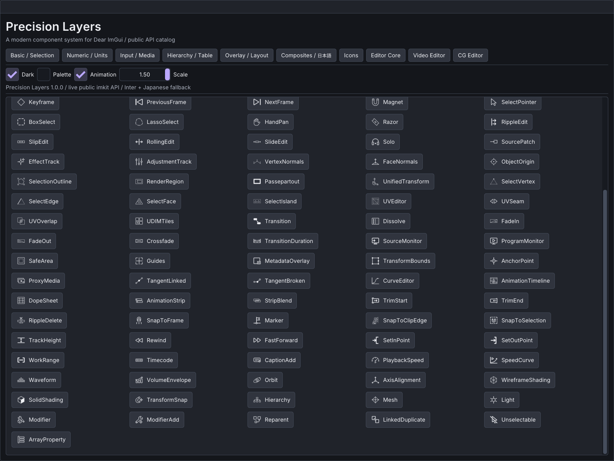

# Modern outline icons

The timeline/3D extension appends 32 IDs, including Empty, Frustum, Camera3D,
Projector3D, geometric primitives and light types. `cg::ObjectView::icon` lets hosts
select a semantic glyph without extending ObjectKind. The existing IDs retain their order.
タイムライン・3D拡張はEmpty、視錐台、3Dカメラ、3Dプロジェクター、基本形状、ライト種別など
32 IDを末尾に追加する。`ObjectView::icon`でObjectKindを増やさず意味に合う図柄を指定できる。
既存IDの順序は維持する。

ImKit includes 238 individually ImageGen-generated monochrome icons in 16 categories.
The artwork is distributed with this repository under its MIT license. The original
generations and their prompts are retained in `assets/icons/originals` and
`assets/icons/prompts`; `provenance.json` records source hashes. Original images use
black strokes because that produced cleaner alpha edges. Packaged PNGs and embedded
atlases use white RGB with the generated alpha, so any tint works on light or dark UI.

## Host integration

Include `<imkit/imkit.h>` (or `<imkit/icons.h>`). There is no new renderer dependency,
context creation, image decoder, file lookup, or runtime download in the library.

```cpp
imkit::IconAtlas icons; // Owned alongside your renderer resources.
for (int size : imkit::IconPixelSizes) {
    const auto pixels = imkit::GetIconAtlasPixels(size);
    // Your renderer: upload pixels.width x pixels.height RGBA8, straight alpha.
    // Use linear filtering, clamp-to-edge, no mipmaps. Retain the GPU resource.
    ImTextureRef texture = UploadRgbaTexture(pixels.width, pixels.height, pixels.rgba);
    icons.SetTexture(size, texture);
}

// Within the host's usual ImGui frame/window:
imkit::Icon(icons, imkit::IconId::Search); // 20 logical pixels; current text color.
imkit::Icon(icons, imkit::IconId::Warning,
            {.size = 24, .color = ImVec4(0.9f, 0.6f, 0.1f, 1)});
if (imkit::IconButton("save", icons, imkit::IconId::Save, "Save document")) {
    SaveDocument();
}
if (imkit::IconLabelButton("open", icons, imkit::IconId::FolderOpen, "Open")) {
    OpenDocument();
}
ImGui::BeginDisabled();
imkit::IconButton("delete", icons, imkit::IconId::Delete, "Delete selection");
ImGui::EndDisabled();

// After the last draw submission using these resources has completed:
icons.Clear();
// Destroy your six GPU resources using the renderer's normal lifetime rules.
```

`UploadRgbaTexture`, `SaveDocument` and `OpenDocument` above are host functions,
not ImKit APIs. See `examples/gallery/main.cpp` for the concrete OpenGL upload.
The existing `IconButton(id, ImGuiDir, accessibleLabel)` overload is unchanged.

## API behavior

- `GetIconCatalog()` returns stable IDs, English names and categories; `GetIconInfo`
  returns null for invalid IDs. The 238 entries follow `assets/icons/catalog.json`.
- `GetIconAtlasPixels` accepts exactly 16, 20, 24, 32, 48 or 64. The returned CPU data
  is immutable with process lifetime; unsupported sizes return an empty view.
- `GetIconRegion` returns the corresponding normalized UV rectangle. Two transparent
  pixels around each atlas cell prevent adjacent glyphs bleeding with linear filtering.
- Upload and bind all six sizes. Rendering selects the smallest level sufficient for
  `options.size * max(DisplayFramebufferScale)`, capped at 64. Sizes above 64 physical
  pixels upscale the bitmap and can look soft. `options.size` defaults to 20; invalid
  or nonpositive values use that default. Application UI scaling should scale this
  logical size too; the Gallery demonstrates it.
- An absent color inherits `ImGuiCol_Text`. Explicit tint affects the glyph; button
  text keeps the theme text color. Both honor style alpha, including disabled state.
- Buttons use native Dear ImGui button hit testing, focus, hover, active and disabled
  behavior. Supply a stable non-null `id`; each control owns an ImGui ID scope.
  Labels provide hover/focus tooltips. This is not an operating-system accessibility
  bridge. Label text after `##` is not drawn.
- An invalid ID or an unbound selected raster level draws no glyph. `Icon` still
  reserves its layout space; buttons are disabled rather than allowing blank actions.
- Each renderer or independently managed context should own an `IconAtlas`. Nothing
  is globally registered. `Clear` only unbinds; it does not delete GPU resources.

## Assets and reproduction

`assets/icons/{16,20,24,32,48,64}` contains 1428 individual transparent PNGs.
`assets/icons/atlases` contains six atlas PNGs. All are included by CMake install
under `share/imkit/icons`. Headers and compiled embedded data are installed normally.
Original large images are kept in the source checkout, not copied into the SDK.

The built-in image generation tool was used individually for each asset; no API key
or generation tool is required by consumers. `assets/icons/prompts` records the exact
generation prompts. Generated raster geometry is approximate, not a mathematically
identical stroke system or a vector icon font.

To rebuild derived assets after replacing an original, install Pillow in your authoring
Python environment and run `python tools/build_icons.py`. This preserves source images,
normalizes their visual extent, converts RGB to white without replacing alpha shapes,
and produces PNG variants plus `src/icons_data.inc`. Missing originals are errors.
Run `python tools/build_icons.py --check` for image/atlas validation. Python and Pillow
are not build or runtime dependencies for C++ consumers.

Atlas rows are derived from catalog length. `metadata.json` records dimensions,
categories and asset counts, and the C++ UV calculations use the generated layout.
`stable-ids.json` freezes the original 120 names in order; new IDs must be appended.
The generator checks the complete public enum against the catalog and validates
original hashes, every derived image and every atlas region.

atlasの行数はcatalog件数から算出します。`metadata.json`に寸法・カテゴリ数・資産数を記録し、
C++のUV計算も生成した配置を使用します。`stable-ids.json`は既存120個の順序を固定し、
新規IDは末尾へ追加します。生成処理は公開enumとcatalogの一致、原画hash、全派生画像、
全atlas領域を検査します。原画や派生物の追加なしに件数だけを増やすことはできません。

## Native Gallery

The Icons page provides category/name search, six sizes, tint and interaction states.
The final catalog has 238 originals (120 stable existing IDs + 118 additions), 1428
size variants and six atlases. The operation map records 250 uses, including 55
native control/drawing representations that do not need separate bitmaps.

Iconsページでカテゴリ・名前、6サイズ、tintと操作状態を確認できます。原画は238個
（既存120 ID保持＋追加118）、サイズ別PNGは1428枚、atlasは6枚です。250用途の対応表には、
bitmapを必要としないnative操作・描画55用途も記録しています。

Additional 3D symbols are available through `ObjectView::icon` and the searchable catalog.
Current checks are recorded in [timeline editing](timeline-editing.md). Generation
validates every original/hash/size/atlas. The image below and
[Editor 1.0 acceptance](editor-validation.md) are the previous baseline.

追加3Dアイコンは`ObjectView::icon`と検索可能なカタログから利用できる。今回の検証結果は
[タイムライン編集](timeline-editing.md)を参照してください。生成処理は全原画hash・サイズ・
atlasを検査する。下の画像とEditor 1.0の検証記録は従来版の記録です。


