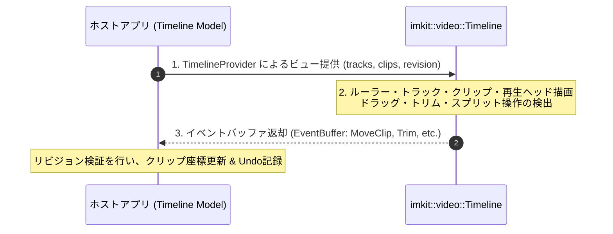

# タイムラインの作成

[English](build-timeline.md) · [目次](../目次.md) · [タイムライン編集仕様](../components/タイムライン編集.md)

動画編集、オーディオシーケンサ、アニメーションキーフレーム作成などに適したマルチトラックタイムライン（`imkit::video`）の構築手順を解説します。
ノードエディタと同様に、タイムラインもホストがデータを所有し、ImKit は描画と操作イベントの報告のみを行う**「プロバイダー & イベント方式」**を採用しています。


---

## コアパターン（プロバイダー & イベント方式）

フレームごとの協調動作は以下の3ステップで完結します：

1. **ビューの提供**: `video::TimelineProvider` がホスト所有のトラックやクリップ情報を参照し、現在の `revision` 番号を付与して提供します。
2. **描画**: `video::Timeline(id, provider, state, selection, events, theme, size)` を呼び出してタイムラインを描画します。
3. **イベント適用**: `ImGui::Render()` の後、`events.Events()` を走査し、現在の `revision` と一致するイベントのみをデータモデルに反映（Commit）します。



---

## 必要な環境

1. Dear ImGui コンテキストとウィンドウ（あなたのアプリまたは Gallery）。
2. CMake で `imkit::video` ターゲットをリンクした環境。
3. ホスト側のデータモデル（トラック、クリップ、Undo履歴）。

---

## 作成するもの

本チュートリアルでは、以下の機能を持つ実践的なタイムライン環境を構築します：
- 複数トラック（映像・音声）のレイアウトとスクロール。
- クリップのドラッグ移動とスナップ配置。
- クリップ端のドラッグによるトリム（伸縮）操作。
- 再生ヘッド（Playhead）の移動と時間ルーラー表示。
- リビジョン番号に基づく安全な編集確定とUndo履歴の生成。

---

## ホスト側モデル（データ所有権）

```cpp
#include <imkit/video.h>
#include <vector>

namespace video = imkit::video;

struct Clip {
    int64_t id;
    int64_t startTick;
    int64_t durationTicks;
    std::string name;
};

struct Track {
    int64_t id;
    std::string title;
    std::vector<Clip> clips;
};

struct TimelineModel {
    uint64_t revision = 1;
    int64_t playheadTick = 0;
    std::vector<Track> tracks;
};
```

---

## 毎フレームの描画処理

```cpp
void RenderTimelineUI(TimelineModel& model, video::TimelineState& state,
                      imkit::editor::Selection& selection, const imkit::Theme& theme) {
    // 1. プロバイダーの構築
    MyTimelineProvider provider(model);

    // 2. イベントバッファの準備
    std::array<imkit::editor::Event, 64> storage;
    imkit::editor::EventBuffer events{storage};

    // 3. タイムラインの描画
    video::Timeline("main_timeline", provider, state, selection, events, theme);

    // 4. 発生した編集イベントをホストモデルに反映
    ApplyTimelineEvents(model, events.Events());
}
```

---

## タイムラインイベントの適用

```cpp
void ApplyTimelineEvents(TimelineModel& model, std::span<const imkit::editor::Event> events) {
    bool changed = false;
    for (const auto& ev : events) {
        if (ev.revision != model.revision) continue; // 古いフレームのイベントは破棄

        switch (ev.kind) {
            case imkit::editor::EventKind::MoveClip:
                // クリップの移動処理
                changed = true;
                break;
            case imkit::editor::EventKind::TrimClipStart:
            case imkit::editor::EventKind::TrimClipEnd:
                // トリム処理
                changed = true;
                break;
            case imkit::editor::EventKind::SeekPlayhead:
                model.playheadTick = ev.value.first;
                break;
            default:
                break;
        }
    }
    if (changed) {
        model.revision++; // モデル変更時にリビジョンを更新
    }
}
```

---

## 実行と動作確認

ImKit Gallery を起動し、**Video** ページを開くと、リップルトリム、ロール編集、スライド編集などの高度なタイムライン操作を確認できます：

```powershell
cmake --build --preset windows-debug --target imkit_gallery --parallel
./build/windows-debug/catalog/Debug/imkit_gallery.exe
```

---

## 内部動作のまとめ

- タイムラインのルーラー単位（Ticks）とピクセル座標の変換は、ImKit がズーム率やスクロールオフセットに応じて自動計算します。
- クリップのドラッグやトリムは即時モードのジェスチャとしてトラッキングされ、確定（Commit）時にイベントが発行されます。
- メディアの再生、デコード、音声波形の生成、動画フレームの描画はホスト側が行います。

---

## 安全な設計を保つための規則

- **タイムライン描画中にクリップ配列を変更しない**: イベント処理ループでまとめて更新します。
- **リビジョン番号でレースコンディションを防ぐ**: バックグラウンド処理や再生中の非同期更新時も、リビジョン照合により安全性が保たれます。
- **再生ヘッド位置とクリップデータは独立して管理する**: シーク操作はクリップの変更ではないため、リビジョンをインクリメントする必要はありません。

---

## 次に読むべきドキュメント

- **[タイムライン編集仕様](../components/タイムライン編集.md)** — リップルトリム、ロール、スライド、外部ドロップの詳細仕様。
- **[エディタスイート](../components/エディタスイート.md)** — 3Dビューポートやアウトライナーと組み合わせた制作環境の構築。
- **[カスタムコンポーネントの作成](カスタムコンポーネントの作成.md)** — テーマと調和する独自UIパーツの拡張。
