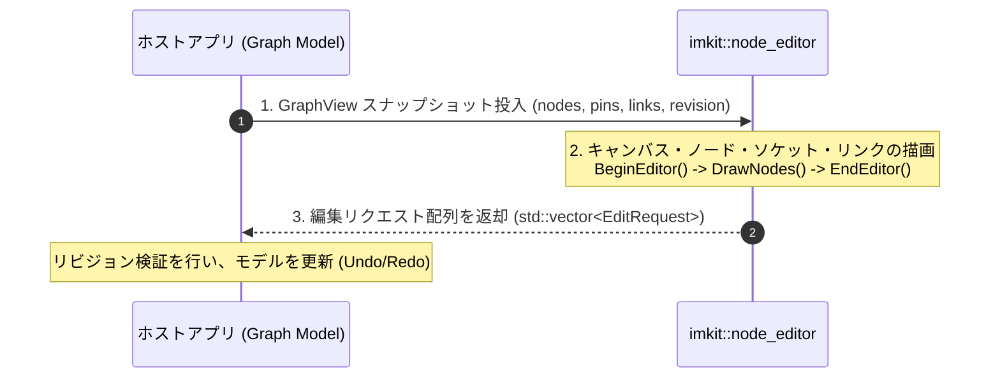

# ノードエディタの作成

[English](build-node-editor.md) · [目次](../目次.md) · [ノードエディタ連携](../components/ノードエディタ.md)

ImKit は、独立したノードベースUIモジュール（`imkit::node_editor`）を提供しています。
このモジュールは、毎フレームホスト側から渡される**「グラフスナップショット」**を描画し、ユーザー操作の結果を**「編集リクエスト（EditRequest）」**の配列としてホストへ返却します。

ライブラリ内部には、ノードグラフの評価エンジン、シリアライザ、クリップボード管理、グローバルシングルトンなどは一切存在しません。グラフデータ構造とUndo/Redo履歴はすべてホストが所有し、ImKit は描画とユーザー意図の報告のみを担います。


---

## コアパターン（スナップショット & リクエスト方式）

フレームごとのホストアプリと ImKit の協調動作は以下の3ステップで完結します：

1. **スナップショット投入**: ホストが所有するデータから `ne::GraphView` を構築し、現在の `revision` 番号を付与してエディタに渡します。
2. **描画**: `BeginEditor()`、`DrawLinks()`、`DrawNodes()`、`NodePalette()`、`EndEditor()` を呼び出します。
3. **リクエスト適用**: `ImGui::Render()` の実行後、返された `EditRequest` 配列をホスト側モデルの `Apply` に渡して更新します。



---

## 必要な環境

1. Dear ImGui コンテキスト（GLFW / SDL / Metal 等のウィンドウ環境または Gallery）。
2. CMake で `imkit::node_editor` ターゲットをリンクした環境。
3. C++20 対応コンパイラ（`std::span`、`std::vector`、`std::erase_if` を使用）。

---

## 作成するもの

本チュートリアルでは、以下の機能を持つ完全なノードグラフ環境を構築します：
- ノードの配置とドラッグ移動。
- ピン同士のドラッグによるワイヤー（リンク）接続。
- ノードやリンクの選択と削除。
- ノードパレット（右クリックまたはTabキー）からの新規ノード追加。
- リビジョン番号に基づく安全なUndo/Redoの基礎。

---

## ホスト側モデル（データ所有権）

```cpp
#include <imkit/node_editor.h>
#include <vector>
#include <cstdint>

namespace ne = imkit::node_editor;

struct GraphModel {
    uint64_t revision = 1;
    std::vector<ne::NodeView> nodes;
    std::vector<ne::PinView> pins;
    std::vector<ne::LinkView> links;

    // スナップショットビューの生成
    ne::GraphView Snapshot() const {
        return ne::GraphView{revision, nodes, pins, links};
    }
};
```

---

## 毎フレームの描画処理

```cpp
void RenderNodeGraph(GraphModel& model, ne::EditorState& state) {
    auto view = model.Snapshot();
    ne::RequestBuffer req;

    if (ne::BeginEditor("MyNodeGraph", view, state, req)) {
        ne::DrawLinks(view);
        ne::DrawNodes(view);
        ne::NodePalette(view);
        ne::EndEditor();
    }

    // 返された編集リクエストを処理
    model.Apply(req.Requests());
}
```

---

## 編集リクエストの適用

ホスト側でリクエストを検証し、現在のリビジョンと一致する場合のみモデルを更新します：

```cpp
void GraphModel::Apply(std::span<const ne::EditRequest> requests) {
    bool mutated = false;
    for (const auto& r : requests) {
        if (r.revision != this->revision) continue; // 古いリビジョンの操作は無視

        switch (r.kind) {
            case ne::RequestKind::MoveNode:
                // ノード座標の更新
                mutated = true;
                break;
            case ne::RequestKind::CreateLink:
                // リンクの追加
                mutated = true;
                break;
            case ne::RequestKind::DeleteSelection:
                // 選択項目の削除
                mutated = true;
                break;
            default:
                break;
        }
    }
    if (mutated) {
        this->revision++; // 変更時にリビジョンをインクリメント
    }
}
```

---

## 実行と動作確認

独立した **Node Editor Gallery** をビルドして起動すると、動的ソケットやミニマップを含む完全な動作を確認できます：

```powershell
cmake --build --preset windows-debug --target imkit_node_editor_gallery --parallel
./build/windows-debug/catalog/Debug/imkit_node_editor_gallery.exe
```

---

## 内部動作のまとめ

- ImKit のノードエディタは、完全な即時モードで動作します。
- スナップショットから矩形レイアウトやワイヤー曲線を計算し、Dear ImGui の DrawList へ描画します。
- ユーザー操作（ドラッグやクリック）は内部状態を直接書き換えるのではなく、すべて `EditRequest` としてホストへ通知されます。

---

## 安全な設計を保つための規則

- **描画中にモデルを書き換えない**: リクエストの適用は、フレーム描画が完了した後にまとめて実行します。
- **リビジョン番号を必ず検証する**: 非同期処理や遅延フレームによる競合を防ぐため、`r.revision == current_revision` を確認します。
- **Undo履歴はホストが記録する**: モデルが変更されたタイミングで、ホスト側でスナップショットを履歴スタックに積みます。

---

## 次に読むべきドキュメント

- **[ノードエディタ統合仕様](../components/ノードエディタ.md)** — 詳細なピン型定義、動的ソケット、ジェスチャ仕様。
- **[タイムラインの作成](タイムラインの作成.md)** — シーケンスや動画編集向けのタイムラインUI構築。
- **[カスタムコンポーネントの作成](カスタムコンポーネントの作成.md)** — デザインシステムトークンを用いた独自部品の作成。
