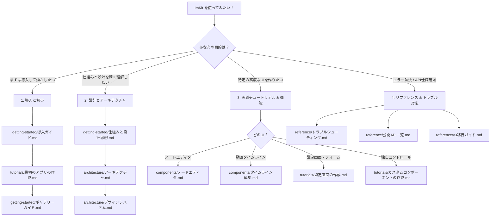

# ImKit ドキュメント

[English](README.md) · [プロジェクト概要](../README.ja.md)

ImKit（Dear ImGui Modern Kit）へようこそ！
このドキュメントは、Dear ImGui を使ったC++デスクトップアプリケーション開発者が、**「何から読み始め、どのように実装へ進めばよいか」** を直感的に理解できるように体系化されています。

---

## 🗺️ 開発者向け学習ロードマップ

「まずは動かしてみたい」「設計思想を理解したい」「特定の機能（ノードエディタやタイムライン等）を組み込みたい」など、目的に応じて最適な順序で読み進めてください。

---

## 📂 体系的ドキュメント構成

ドキュメントは以下の5つのカテゴリに分類されています：

### 1. 入門・基本概念 (`getting-started/`)
ImKitの基本概念、導入手順、動作原理を学ぶためのドキュメントです。
- **[導入ガイド](getting-started/導入ガイド.md)**: 必要環境、CMakeによる組み込み手順、最短動作確認。
- **[利用ガイド](getting-started/利用ガイド.md)**: アプリケーション初期化から最初のコントロール描画までの流れ。
- **[仕組みと設計思想](getting-started/仕組みと設計思想.md)**: ホストアプリケーションとImKitの所有権の境界、即時モードでの動作原理。
- **[ギャラリーガイド](getting-started/ギャラリーガイド.md)**: 付属のGalleryサンプルの動かし方とコードの追い方。
- **[実例とレシピ](getting-started/実例とレシピ.md)**: よく使う実装パターンのコードスニペット集。

### 2. 実践チュートリアル (`tutorials/`)
ステップバイステップで実際に動くコードを作りながら学ぶCodelabです。
- **[最初のアプリの作成](tutorials/最初のアプリの作成.md)**: ImKitを使った最小構成のウィンドウアプリケーション作成。
- **[設定画面の作成](tutorials/設定画面の作成.md)**: トグル、スライダー、保存/バリデーション処理を含む実践的なUI作成。
- **[ノードエディタの作成](tutorials/ノードエディタの作成.md)**: グラフデータ投入から編集リクエスト処理までのノードUI構築。
- **[タイムラインの作成](tutorials/タイムラインの作成.md)**: トラック、クリップ、キーフレーム操作のタイムラインUI構築。
- **[カスタムコンポーネントの作成](tutorials/カスタムコンポーネントの作成.md)**: `ThemeScope`とセマンティックトークンを使った独自ウィジェットの実装。

### 3. 設計・デザインシステム (`architecture/`)
ImKitの内部構造、デザイントークン、テーマ、依存関係に関する公式仕様です。
- **[アーキテクチャ](architecture/アーキテクチャ.md)**: 厳密な所有モデル、モジュール構成、公開契約の権威的リファレンス。
- **[デザインシステム](architecture/デザインシステム.md)**: カラーパレット、スペーシング、アクセシビリティ仕様。
- **[テーマ](architecture/テーマ.md)**: 組み込みプリセット（Dark / Light等）の適用とカスタムテーマ作成。
- **[アイコン](architecture/アイコン.md)**: 280種類以上のベクターアイコン（Lucide）の使い方とアトラス管理。
- **[依存関係](architecture/依存関係.md)**: Dear ImGuiの固定リビジョン要件、プラットフォーム別のビルド条件。

### 4. 機能・コンポーネント詳細 (`components/`)
各専門モジュールの詳細仕様と統合手順です。
- **[基本コンポーネント](components/基本コンポーネント.md)**: ボタン、バッジ、セレクト、入力フォーム等のUIパーツ。
- **[ノードエディタ](components/ノードエディタ.md)**: `imkit::node_editor` のスナップショット/リクエスト方式の統合。
- **[タイムライン編集](components/タイムライン編集.md)**: `imkit::video` によるタイムライン操作とジェスチャ。
- **[エディタスイート](components/エディタスイート.md)**: ツール向け複合ワークスペース（Video、CG、Core）。
- **[ワークフローコンポーネント](components/ワークフローコンポーネント.md)**: ステップ進行、進捗表示、プレビュータイル。
- **[シェルコンポーネント](components/シェルコンポーネント.md)**: アプリケーションの外枠、ステータスバー、ツールバー。
- **[ウィンドウフレーム](components/ウィンドウフレーム.md)**: OS統合（Windows/macOS）とカスタムタイトルバー描画。

### 5. リファレンス・API・検証 (`reference/`)
型定義、API署名、移行情報、検証データです。
- **[公開API一覧](reference/公開API一覧.md)**: Dear ImGuiとImKitの関数対応表。
- **[エディタAPI](reference/エディタAPI.md)**: Editorモジュールの詳細な型・インターフェース署名。
- **[ウィジェット一覧](reference/ウィジェット一覧.md)**: 提供されている全ウィジェットの一覧カタログ。
- **[文書カタログ](reference/文書カタログ.md)**: 各ドキュメントと実装ソース・Gallery画面の完全対応表。
- **[検証記録](reference/検証記録.md)**: 自動テスト、パフォーマンス計測、実機検証の記録。
- **[v3移行ガイド](reference/v3移行ガイド.md)**: v2からv3への破壊的変更と移行ステップ。
- **[トラブルシューティング](reference/トラブルシューティング.md)**: ビルド時・実行時によくある問題と解決策。

---

## 💡 ImKit を使う上での最重要原則

ImKit を扱う上で覚えておくべき基本はただ1つです：

> **「あなたはすべてを所有し、ImKit は描画とイベント報告のみを行う」**

Dear ImGui のコンテキスト、メモリ確保、データの永続化、Undo/Redo、ビジネスロジックはすべて**あなたのホストアプリケーション**が所有します。ImKit は自ら状態を保持したりデータを勝手に書き換えたりしません。返されたリクエスト（「ボタンが押された」「クリップが移動された」など）をホスト側で解釈してデータを更新してください。

詳細は [仕組みと設計思想](getting-started/仕組みと設計思想.md) をご覧ください。
