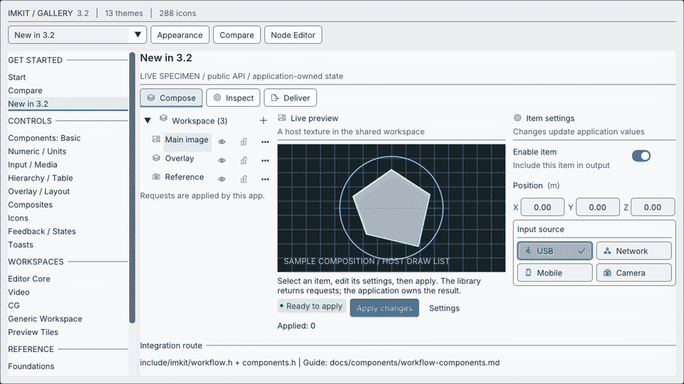

## Use this when

Use the components module when a creative tool needs consistent settings rows, buttons, inputs and feedback while keeping its existing Dear ImGui context and application values.

## Gallery capture



Components — settings, selection and feedback · [Open the native Gallery animation](https://raw.githubusercontent.com/AokiMotohide/imgui-modern-kit/main/docs/images/v3-overview.gif)

## Minimum drawing example

```cpp
#include <imkit/imkit.h>

void DrawApplyButton() {
    if (imkit::ActionButton("Apply", imkit::ActionVariant::Primary)) {
        // The application validates and applies its own document state.
    }
}
```

**Example type:** Function excerpt for an existing application frame. Call it between `NewFrame` and `Render`, then handle the returned activation in the application.

## Integrate with the application

Link `imkit::imkit`. Edited values and stable IDs stay in the application; use the returned boolean as an action request.

## Scope

These are immediate-mode controls, not an application model, persistence layer or command dispatcher.

## Related API and guides

- [Native API index](../../api/native/)
- [Component inventory](../../api/widgets/)

---

ImKit components are small compositions over public Dear ImGui behavior. Edited values, lifetime and persistence remain in the host. The recipe below shows a complete frame-level settings panel; the smaller examples that follow highlight individual controls.

## Complete settings panel

Keep the values in application state and draw the panel during the host's existing Dear ImGui frame. The function returns a save request; it does not write a file or own a notification queue.

```cpp
#include <imkit/imkit.h>
#include <array>

struct DisplaySettings {
    bool enabled = true;
    int quality = 1;
    char qualitySearch[64]{};
    float exposure = 0.0f;
    char name[128] = "Main display";
    bool showSavedNotice = false;
};

bool DrawDisplaySettings(DisplaySettings& settings, const imkit::Theme& theme, double now) {
    imkit::ThemeScope themeScope(theme); // Same live context; destroyed before that context.
    bool saveRequested = false;
    if (imkit::Begin("Display settings")) {
        imkit::Toggle("Enabled", &settings.enabled, {&theme});

        if (imkit::BeginSettingRow("quality", "Quality")) {
            constexpr std::array<const char*, 3> labels{"Draft", "Balanced", "High"};
            imkit::SearchableCombo("##quality", &settings.quality, labels,
                                   settings.qualitySearch, sizeof(settings.qualitySearch));
            imkit::EndSettingRow();
        }

        if (imkit::BeginSettingRow("exposure", "Exposure")) {
            imkit::DragFloatWithUnit("##exposure", &settings.exposure, "EV", 0.01f, -8.0f, 8.0f);
            imkit::EndSettingRow();
        }

        imkit::InputTextWithHint("Name", "Required", settings.name, sizeof(settings.name));
        const bool invalidName = settings.name[0] == '\0';
        imkit::ValidationMessage("Enter a name before saving.", invalidName, &theme);
        imkit::BeginDisabled(invalidName);
        saveRequested = imkit::ActionButton("Save", imkit::ActionVariant::Primary, {}, {&theme});
        imkit::EndDisabled();

        if (settings.showSavedNotice &&
            imkit::NotificationCard({"saved", "Settings saved", imkit::StatusKind::Success, 0}, now, &theme)) {
            settings.showSavedNotice = false; // The host handles the dismiss request.
        }
    }
    imkit::End(); // Pair with Begin even when it returned false.
    return saveRequested; // The host persists settings and decides when to show a notice.
}
```

Call this from the host's frame after `NewFrame()` and before `Render()`. When it returns `true`, validate and persist `DisplaySettings` in the host, then set `showSavedNotice`. Keep `Theme`, font pointers, the Dear ImGui context and the panel state alive in the host.

## Primary action

```cpp
if (imkit::ActionButton("Apply", imkit::ActionVariant::Primary, {}, {&theme, &animation}))
    SaveSettings();
```

Use primary once per decision area. Secondary, ghost and destructive variants express intent without changing button activation semantics.

## Boolean and mixed state

```cpp
imkit::Toggle("Enabled", &enabled, {&theme, &animation});
imkit::IndeterminateCheckbox("Inherited", &state);
```

`Toggle` returns whether the value changed. `IndeterminateCheckbox` moves `Mixed` to `Checked` on activation; store its enum beside the rest of the host model.

## Search and validation

```cpp
imkit::SearchableCombo("Quality", &quality, labels, search, sizeof(search), disabled);
imkit::InputTextWithHint("Name", "Required", name, sizeof(name));
imkit::ValidationMessage("A name is required", name[0] == 0, &theme);
```

Search buffers and selected indexes are host-owned. Validation draws feedback but does not reject or store values.

## Settings and units

```cpp
if (imkit::BeginSettingRow("exposure", "Exposure")) {
    imkit::DragFloatWithUnit("##value", &exposure, "EV", .01f, -8.f, 8.f);
    imkit::EndSettingRow();
}
```

Call `EndSettingRow` only when `BeginSettingRow` returns true. Native scalar parsing and precision are preserved.

For a three-axis drag value, use `DragVector3WithUnit("Offset", values, "cm", .1f, -10.f, 10.f)`. Each axis remains a native `DragFloat`; the label scopes its stable IDs and narrow widths stack the fields.

## Status and notification

```cpp
imkit::StatusBadge("Ready", imkit::StatusKind::Success, &theme);
if (imkit::NotificationCard({"saved", "Settings saved", imkit::StatusKind::Success, 0}, now, &theme))
    dismissSavedNotice = true;
```

Notification expiry and removal belong to the host. More overload-level details are in [API coverage](../../api/native/).

## Compact status and actions

```cpp
imkit::CompactActionRowOptions row;
row.statusText = streaming ? "Streaming" : "Stopped";
row.statusKind = streaming ? imkit::StatusKind::Success : imkit::StatusKind::Neutral;
row.primaryLabel = streaming ? "Stop" : "Connect";
row.primaryVariant = streaming ? imkit::ActionVariant::SubtleDestructive
                               : imkit::ActionVariant::Primary;
row.settingsLabel = "Settings";

switch (imkit::CompactActionRow("camera-1", row)) {
case imkit::CompactActionRowRequest::Primary: requestConnectionChange = true; break;
case imkit::CompactActionRowRequest::Settings: openSettings = true; break;
case imkit::CompactActionRowRequest::None: break;
}
```

`CompactActionRow` draws host-provided status and actions, then returns a request. Connection state, command execution, and settings window lifetime stay with the host. When the available width is too narrow, it wraps the status and actions onto multiple lines.
Each action can be disabled independently; its disabled reason appears in that button's tooltip. Use `SubtleDestructive` for reversible risky actions such as stopping a stream.

`NotificationCard` returns a dismiss request. A zero `expiresAt` means it remains visible until the host removes it; a nonzero expiration is compared with the `now` value supplied by the host.

## ImKit 3.2 workspace

Open **New in 3.2** in the Gallery to use WorkspaceTabs, HierarchyGroupHeader/HierarchyRow, BeginInspectorCard/EndInspectorCard, SettingToggleRow, DragVector3WithUnit, ChoiceGroup and CompactActionRow together. Requests update Gallery-owned values; the same pattern works in an existing ImGui frame. See the [3.2 declarations and lifetime rules](../../api/v3-2/). All 288 runtime icons and 13 themes are available without introducing a new context or application framework.
