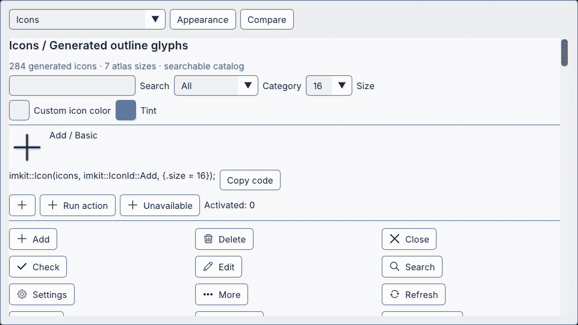

## 用途

編集toolの操作に同梱icon catalogを使い、atlas uploadとGPU resourceはrenderer側で管理します。

## Galleryの画面



Icons — atlasとlabel付き操作 · [Galleryの操作映像を開く](https://raw.githubusercontent.com/AokiMotohide/imgui-modern-kit/main/docs/images/gallery-icons.gif)

## 最小描画例

```cpp
#include <imkit/icons.h>

bool DrawSaveAction(imkit::IconAtlas& icons) {
    return imkit::IconButton("save", icons, imkit::IconId::Save, "Save document");
}
```

**例の種別:** 完結した関数例です。描画前にatlas textureを登録し、戻り値の操作はアプリ側で処理します。

## アプリへ組み込む

7種類からatlas sizeを選んでアプリのrendererでuploadし、`IconAtlas`へ登録します。描画完了後にGPU resourceを解放します。

## 範囲

Iconsはrenderer、image decoder、file検索、OS accessibility bridgeを追加しません。

## 関連APIとガイド

- [WindowFrameガイド](../window-frame/)
- [公開icons header](https://github.com/AokiMotohide/imgui-modern-kit/blob/main/include/imkit/icons.h)

---

Icon APIは公開header `<imkit/icons.h>`と`imkit::imkit` targetで利用できます。描画は現在のDear ImGui frameへ行い、font atlasまたはtextureの準備・upload・破棄はホストが担当します。

## Host統合

Icon IDと描画関数は[`include/imkit/icons.h`](https://github.com/AokiMotohide/imgui-modern-kit/blob/main/include/imkit/icons.h)を参照してください。Gallery sampleのtexture登録方法を利用アプリのrenderer契約と同一視しないでください。

frame内では、hostがuploadした`IconAtlas`と公開IDを使って`imkit::Icon(atlas, imkit::IconId::Search)`を呼びます。

正確な型と描画overloadは公開headerと[English API behavior](../../en/features/icons/#api-behavior)を参照してください。

## API behavior

`Icon`は現在のframeにatlasのspriteを描画します。`IconButton`/`IconLabelButton`はIDとaccessibility labelを受け取り、押下結果を返します。texture未設定または無効IDでは描画せず、buttonを無効にします。正確なoverloadは公開headerを参照してください。

## Assets and reproduction

生成icon dataのsource・再生成手順・license記録は英語版の[Assets and reproduction](../../en/features/icons/#assets-and-reproduction)と`THIRD_PARTY_NOTICES.md`にあります。Icon APIはhost font、GPU atlas、texture registry、保存を所有しません。配布時は同梱noticeに従ってください。

## Native Gallery

Gallery **Icons** pageでは検索、atlas表示、各IDのsymbolを操作できます。page登録と描画実装は[`gallery.cpp`](https://github.com/AokiMotohide/imgui-modern-kit/blob/main/examples/gallery/gallery.cpp)にあります。Themeとの併用は[Theme guide](../themes/)を参照してください。
