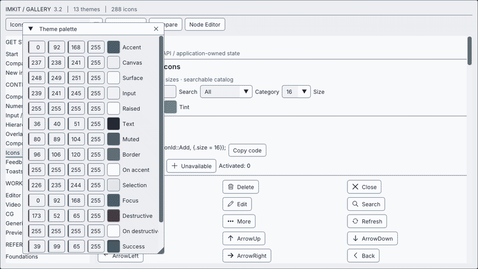

## 用途

テーマpresetを選び、必要に応じて色や寸法を調整します。Themeは値のcopyで、所有権はアプリ側にあります。

## Galleryの画面



Themes — ライト・ダークの配色 · [Galleryの操作映像を開く](https://raw.githubusercontent.com/AokiMotohide/imgui-modern-kit/main/docs/images/v3-theme-comparison.gif)

## 最小描画例

```cpp
#include <imkit/theme.h>

imkit::Theme MakeForestTheme() {
    auto theme = imkit::MakeTheme(imkit::ThemePreset::Forest);
    imkit::SetAccent(theme, {0.20f, 0.62f, 0.46f, 1.0f});
    return theme;
}
```

**例の種別:** 完結した関数例です。返されたTheme値はアプリ側で保持し、有効なContext上で`NewFrame`より前に適用します。

## アプリへ組み込む

戻り値はアプリ側で保持し、有効なContext上で`NewFrame`より前に`ApplyTheme(theme, scale)`を呼びます。フォントはアプリ側のatlasへ読み込み、描画で参照する間有効に保ちます。atlasとContextの寿命もアプリ側が管理します。

## 範囲

Themeは外観の値を適用します。Context生成やOS font読み込みは行わず、任意の色変更でcontrastを保証しません。

## 関連APIとガイド

- [Design-system header一覧](../../api/design-system/)
- [Native API一覧](../../api/native/)

---

ImKit は、13種類の洗練された名前付きプリセットと、柔軟なカスタマイズ API を提供しています。

---

## 組み込みプリセット一覧

`ThemePresets()` を呼び出すことで、全13種類のプリセット情報を取得できます。各プリセットには enum 値、永続化用の小文字 ID（例: `"precision-dark"`）、表示名が定義されています。

| カラースキーム | プリセット名 | 特徴 |
|---|---|---|
| **Dark** | `PrecisionDark` | ImKit の標準ダークテーマ。落ち着いたグレーとシアンアクセント |
| | `Graphite` | 黒に近い深いグレー基調 |
| | `Midnight` | 深夜の青みを帯びたダークネイビー |
| | `Ocean` | 海洋をイメージした深い青緑色 |
| | `Forest` | 自然な深いフォレストグリーン |
| | `Violet` | 高級感のあるダークパープル |
| | `Slate` | スレート石のような青灰色 |
| | `HighContrastDark` | コントラスト比を高めた視認性重視のダークテーマ |
| **Light** | `PrecisionLight` | ImKit の標準ライトテーマ。クリーンな白と淡いグレー |
| | `WarmSand` | 暖かみのあるサンドベージュ |
| | `Rose` | 優しいピンクがかったペールトーン |
| | `Solar` | 明るい太陽光のような暖色ライト |
| | `HighContrastLight` | 視認性重視の高コントラストライトテーマ |

---

## コード例: テーマの選択と復元

設定ファイルへ保存する際は、enum の整数値ではなく「安定した小文字 ID」を保存することを推奨します：

```cpp
#include <imkit/theme.h>

// 1. プリセットから直接生成
auto theme = imkit::MakeTheme(imkit::ThemePreset::Forest);

// 2. 保存されていた文字列IDから安全に復元（フォールバック付き）
std::string savedId = "graphite";
auto preset = imkit::ThemePresetFromId(savedId)
    .value_or(imkit::ThemePreset::PrecisionDark);
auto currentTheme = imkit::MakeTheme(preset);
```

---

## 配色のカスタマイズ (`SetAccent`)

ブランドカラーやプロジェクトのテーマカラーに合わせて、アクセント色を一括変更できます：

```cpp
// アクセントカラーをオレンジに変更
// ※ ボタン背景、フォーカス枠、選択ハイライトなどが連動して更新されます
imkit::SetAccent(theme, ImVec4(1.0f, 0.5f, 0.0f, 1.0f));
```

さらに細かい配色を調整したい場合は、`theme.semantic.*` または `theme.colors.*` の各フィールドを直接編集し、`imkit::ResolveTheme(theme)` を呼び出します。

---

## スケール倍率と `ThemeScope`

- **スケール倍率**: `ApplyTheme(theme, scale)` の `scale` 引数により、UI 全体の表示倍率を 50%～250%（既定: 125%）の範囲で調整可能です。未拡大の元トークンから毎回スタイルを再計算するため、毎フレーム呼び出してもサイズが累積することはありません。
- **部分的なテーマ適用**: 一部のダイアログやパネルだけに異なるテーマを適用したい場合は `imkit::ThemeScope` を利用します。
