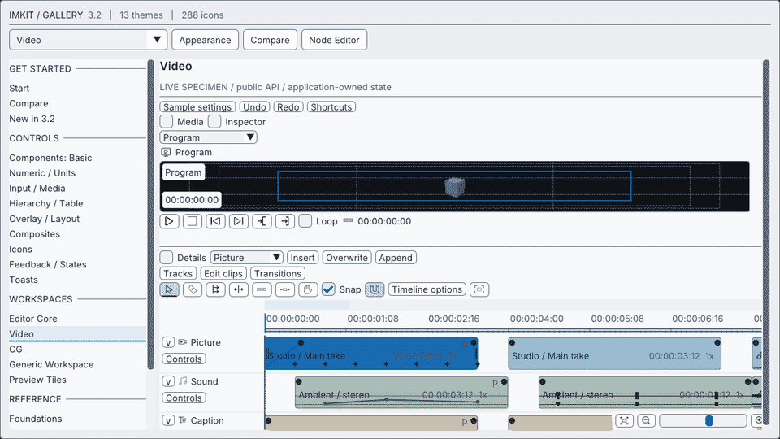

## 用途

アプリ側のmedia modelに、track、clip、keyframe、編集操作を表示する場合に使います。

## Galleryの画面



Timeline — clip、track、編集操作 · [Galleryの操作映像を開く](https://raw.githubusercontent.com/AokiMotohide/imgui-modern-kit/main/docs/images/v3-timeline.gif)

## 最小描画例

```cpp
#include <imkit/video.h>
#include <imkit/editor_core.h>

void DrawTimeline(const imkit::video::TimelineProvider& provider,
                  imkit::video::TimelineState& state,
                  imkit::editor::Selection& selection,
                  imkit::editor::EventBuffer& events,
                  const imkit::Theme& theme) {
    imkit::video::Timeline("timeline", provider, state, selection, events, theme);
}
```

**例の種別:** アプリの状態を引数に取る関数例です。provider dataとevent buffer、編集反映はアプリ側が所有します。

## アプリへ組み込む

Begin/Update/Commit/Cancel eventをまとめて処理し、model変更前にrevisionとcollisionを検証します。

## 範囲

Timelineは編集UIです。再生engine、media decoder、project保存機能ではありません。

## 関連APIとガイド

- [Timeline操作契約](./)
- [Editor APIリファレンス](../../api/editor-suite/)

---

`imkit::video` モジュールは、プロ向けのマルチトラックタイムラインエディタ機能を提供します。
`TimelineEditingProvider` を実装することで、クリップのフェードイン/アウト、トランジション（Crossfade / Dissolve）、複数クリップの矩形選択、トラック間移動や並べ替えなどの高度な編集操作が有効になります。

---

## 編集ジェスチャとマウス操作 (Input)

| 操作対象 | マウス・キーボード操作 | 動作仕様 |
|---|---|---|
| **フェードイン / アウト** | クリップ上端のハンドルをドラッグ | フェード時間の調整。ハンドル右クリックでカーブ形状（Linear / EaseIn / EaseOut）を選択 |
| **トランジション** | `TransitionShelf` から隣接クリップの境界へドラッグ | Dissolve（ビデオ向け）または Crossfade（オーディオ向け）を挿入。ドラッグで長さを調整 |
| **クリップ選択** | 空白領域をドラッグ | ラバーバンド（矩形）選択。Shiftキーで追加選択、Ctrlキーでトグル選択 |
| **クリップ移動** | 選択クリップをドラッグ | 選択された複数クリップの相対位置を保ったままトラック間を移動 |
| **ズーム & パン** | `Ctrl + マウスホイール`<br>`Shift + マウスホイール`<br>`中ボタンドラッグ` | マウスポインタ位置を中心としたズーム<br>横方向スクロール<br>タイムライン全体のパン操作 |
| **トラックの並べ替え** | トラックヘッダーをドラッグ | 行の前後へトラックを挿入・並べ替え |

---

## イベント契約仕様 (Event contract)

タイムライン操作が発生すると、以下の `editor::Event` が発行されます：

- **`ClipFades`**: クリップのフェードイン／アウト長さ、およびイージングカーブ。
- **`CutTransition`**: 隣接クリップ間のトランジション種別と継続時間。
- **`TrackEdit`**: トラックの追加、削除、複製、順序変更。
- **`Clipboard`**: クリップのコピー・カット・ペースト要求（再生ヘッド位置を基準にペースト）。

> [!IMPORTANT]
> タイムラインは描画と操作イベントの生成のみを行います。実際の音声/映像の合成処理、メディアデコード、ファイルへの保存、および Undo/Redo のスタック管理はホストアプリケーション側で行ってください。

---

## 検証とGallery (Verification)

Gallery の **Video** 画面（ページID: 8）で対話的に動作を検証できます。また、コマンドラインオプション `--verify-timeline-ui` を指定して起動することで、フェード作成、プレビュー/確定、Undo、マルチトラック選択、10万クリップ時の可視範囲クエリの負荷検証を自動実行できます。
実機メディアの再生・デコードやOSネイティブIME連携はホスト側の検証対象です。
