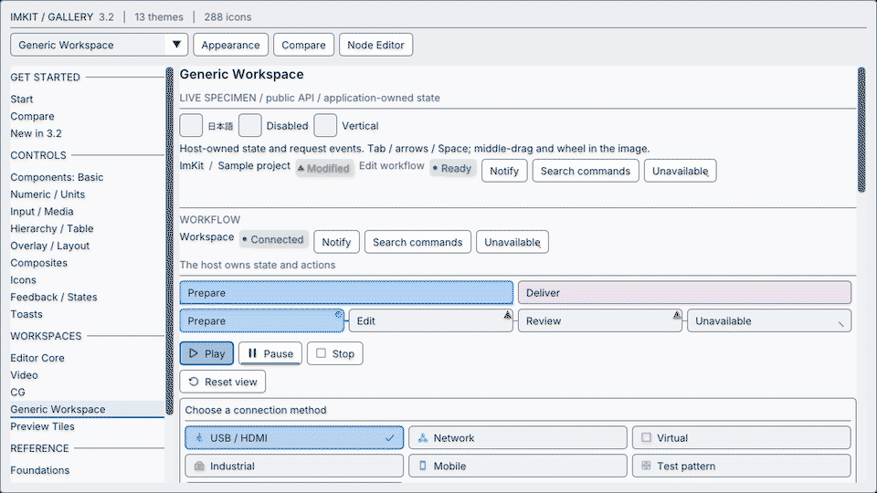

## 用途

アプリ側で管理する処理に進捗、空・利用不可状態、通知、navigation、responsive toolbarを加える部品です。

## Galleryの画面



Workflow — 進捗と状態の表示 · [Galleryの操作映像を開く](https://raw.githubusercontent.com/AokiMotohide/imgui-modern-kit/main/docs/images/v3-workflow-progress.gif)

## 最小描画例

```cpp
#include <imkit/workflow.h>

void DrawImportProgress() {
    const imkit::CircularProgressView progress{
        0.42f, "42%", "素材を読み込み中"
    };
    imkit::CircularProgress("asset-import", progress);
}
```

**例の種別:** 公開headerの型を使う完結した関数例です。アプリのImGuiフレーム中に呼び、表示文字列は描画が終わるまで保持します。

## アプリへ組み込む

`imkit::imkit`をlinkします。進捗値、取消、通知queue、texture、保存はアプリ側で管理します。

## 範囲

状態を描画する部品です。worker実行、完了判定、通知の保存は行いません。

## 関連APIとガイド

- [Workflowガイド](./)
- [Application shellガイド](../shell/)

---

`<imkit/workflow.h>` は、マルチステップのウィザード、進捗表示、画像ビューア、レスポンシブツールバー、および通知システムなど、制作ツールのワークフローを支える汎用UIコンポーネント群を提供します。

---

## 所有モデル

- **データとキューはホスト所有**: 表示ラベル、画像テクスチャ、進捗率、通知キューはすべてホスト側が所有し、ImKit は描画時に借用（非所有ポインタ/参照）します。`ChoiceGroup`も候補と任意の`IconAtlas`を借用し、現在の選択値は変更せず、候補IDによる要求だけを返します。
- **イベントのバッファリング**: ユーザー操作（ステップの切替、タイルのリサイズ等）はホスト提供のイベントバッファに書き込まれ、フレーム終了後にホストが処理します。

---

## 提供コンポーネント一覧

| カテゴリ | コンポーネント / API | 主な役割と動作仕様 |
|---|---|---|
| **ナビゲーション** | `StepNavigator`<br>`NavigationRail` | ステップ形式の進行バー、縦型ナビゲーションレール。選択要求を返却 |
| | `WorkspaceTabs` | アイコンとラベル付きのワークスペースタブ。狭幅時は自動でコンボボックスへ縮約 |
| | `ChoiceGroup` | 見出し付きカードに候補を1〜3列で表示。列数を幅に合わせ、選択要求の安定IDを返す |
| **ツリー・設定** | `HierarchyGroupHeader`<br>`HierarchyRow` | シーングラフ等の階層行。表示/非表示、ロック、選択状態のトグル |
| | `BeginInspectorCard`<br>`EndInspectorCard` | 関連コントロールを美しくまとめる境界線付きカードコンテナ |
| **フィードバック** | `StatusBadge`<br>`InlineAlert` | 成功・警告・エラーを色とアイコンで示すアラートコンポーネント |
| | `ToastRegion` | 画面隅にスタック表示されるトースト通知領域（フォーカスを奪わない設計） |
| | `EmptyState`<br>`UnavailableState` | データが存在しない時やオフライン時の案内画面（アイコン・見出し・再試行ボタン） |
| | `Progress`<br>`CircularProgress` | バー型および円型の進捗インジケータ（不確定アニメーション対応） |
| **画像・ビューア** | `BeginImageViewport`<br>`EndImageViewport` | パン・ズーム対応の画像表示キャンバス |
| | `ResolveImagePlacement` | 画像の Fit（全体表示）/ Fill（全域切り抜き）/ Stretch（引き伸ばし）の座標・UV計算 |
| | `DrawOverlay` | 画像上の点、ポリライン、矩形、円、ラベル等の注釈描画 |
| | `PreviewTile`<br>`ResizableTileStrip` | 水平/垂直スクロール可能なリサイズ対応プレビュータイル列 |

`ChoiceGroup`のボタン高は通常の入力欄と同じで、カードの内側には8pxの余白を取ります。最長のラベル、任意のアイコン、選択マークが収まらない場合は列数を減らします。ラベル内の`##`以降はImGui/UIテスト用IDとして使い、表示文字・ツールチップ・アクセシビリティ名から除きます。説明と利用不可理由はホバーまたはフォーカス時に表示します。公開API compile fixtureは[`tests/workflow_api_compile.cpp`](https://github.com/AokiMotohide/imgui-modern-kit/blob/main/tests/workflow_api_compile.cpp)で確認します。Dear ImGui aliasのAPI一覧とは分けて管理します。

---

## Gallery での確認

6位置、操作、進行表示に対応した色付きカードは[トースト](../toasts/)を参照してください。既存の `ToastRegion` の挙動は維持します。

Gallery アプリの以下の画面で実際の挙動を確認できます：
- **Generic Workspace** (ページID: 15): 接続方式のChoiceGroup、ナビゲーション、ツールバー、画像ビューア、オーバーレイの統合例。
- **Feedback / States**: 各種アラート、プログレスバー、エンプティステートの表示例。
- **Preview Tiles**: 可変サイズプレビュータイルの操作例。

実装コードは [`examples/gallery/workflow_pages.cpp`](https://github.com/AokiMotohide/imgui-modern-kit/blob/main/examples/gallery/workflow_pages.cpp) を参照してください。

## ImKit 3.2の作業画面

Galleryの **New in 3.2** では、WorkspaceTabs、HierarchyGroupHeader／HierarchyRow、BeginInspectorCard／EndInspectorCard、SettingToggleRow、DragVector3WithUnit、ChoiceGroup、CompactActionRowを組み合わせて操作できます。要求を受けてGallery側の値を更新する実装は、既存のImGuiフレームでも利用できます。[3.2の宣言と寿命の規則](../../api/v3-2/)を参照してください。288アイコンと13テーマを利用でき、Contextやアプリのフレーム管理は引き続きホストが担当します。
